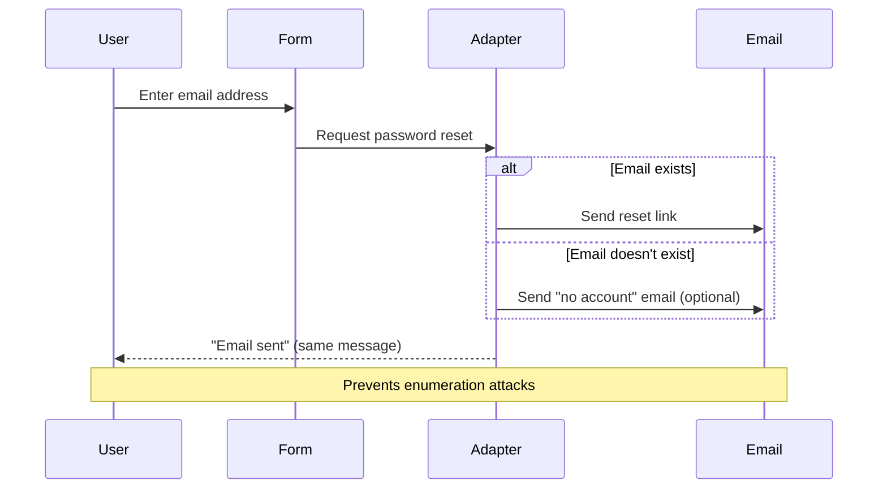

## Overview

django-allauth provides comprehensive account management capabilities that go far beyond simple login/logout. It handles user registration, multiple email addresses, password changes, and complex email verification workflows.

<Info>
The `allauth.account` app is the core module responsible for managing regular (non-social) user accounts.
</Info>

## User Registration (Signup)

### Signup Fields Configuration

Control which fields appear in your signup form using `ACCOUNT_SIGNUP_FIELDS`:

```python
# settings.py

# Email-based signup (no username)
ACCOUNT_SIGNUP_FIELDS = ['email*', 'password1*', 'password2*']

# Username-based signup
ACCOUNT_SIGNUP_FIELDS = ['username*', 'email', 'password1*', 'password2*']

# With email confirmation (type twice to avoid typos)
ACCOUNT_SIGNUP_FIELDS = ['email*', 'email2*', 'password1*', 'password2*']

# Phone number support
ACCOUNT_SIGNUP_FIELDS = ['username*', 'email', 'phone', 'password1*', 'password2*']
```

<Note>
Fields marked with `*` (e.g., `'email*'`) are required. Fields without `*` are optional.
</Note>

### Custom Signup Forms

Add custom fields to the signup process:

<CodeGroup>
```python forms.py
from django import forms
from allauth.account.forms import SignupForm

class CustomSignupForm(forms.Form):
    """
    Custom signup form that collects additional user data.
    
    Must implement a signup() method that is called after the user is created.
    """
    first_name = forms.CharField(
        max_length=30, 
        label='First Name',
        required=True
    )
    last_name = forms.CharField(
        max_length=30, 
        label='Last Name',
        required=True
    )
    date_of_birth = forms.DateField(
        widget=forms.SelectDateWidget(years=range(1920, 2010)),
        required=False
    )
    accept_terms = forms.BooleanField(
        required=True,
        label='I accept the Terms of Service'
    )
    
    def signup(self, request, user):
        """
        Called after user account is created.
        Save custom fields to user profile or related model.
        """
        user.first_name = self.cleaned_data['first_name']
        user.last_name = self.cleaned_data['last_name']
        user.save()
        
        # Create or update user profile
        user.profile.date_of_birth = self.cleaned_data.get('date_of_birth')
        user.profile.save()
```

```python settings.py
# Point to your custom form class
ACCOUNT_SIGNUP_FORM_CLASS = 'myapp.forms.CustomSignupForm'
```
</CodeGroup>

### Honeypot Field for Spam Prevention

Protect against naive spam bots with a honeypot field:

```python
# settings.py
ACCOUNT_SIGNUP_FORM_HONEYPOT_FIELD = 'phone_number'
```

This adds a hidden field to the signup form. Legitimate users won't see it, but bots may fill it out. If the field contains data, the signup is silently rejected while appearing successful to the bot.

<Warning>
Honeypots work against simple bots but won't stop sophisticated attacks. Use in combination with other anti-spam measures.
</Warning>

## Email Address Management

### The EmailAddress Model

django-allauth maintains a separate `EmailAddress` model with powerful features:

```python
from allauth.account.models import EmailAddress

class EmailAddress(models.Model):
    user = models.ForeignKey(settings.AUTH_USER_MODEL, on_delete=models.CASCADE)
    email = models.EmailField(max_length=254)
    verified = models.BooleanField(default=False)
    primary = models.BooleanField(default=False)
```

<Tabs>
  <Tab title="Single Email Mode">
    Users have exactly one email address that can be changed.
    
    ```python
    # settings.py
    ACCOUNT_CHANGE_EMAIL = True
    ACCOUNT_MAX_EMAIL_ADDRESSES = None
    ```
    
    When changing email:
    1. User adds new email address
    2. Verification email sent to new address
    3. Upon verification, new email replaces old email
    4. Old email is automatically removed
  </Tab>
  
  <Tab title="Multiple Email Mode">
    Users can manage multiple email addresses with one primary.
    
    ```python
    # settings.py
    ACCOUNT_CHANGE_EMAIL = False
    ACCOUNT_MAX_EMAIL_ADDRESSES = 5  # Limit to 5 email addresses
    ```
    
    Features:
    - Add multiple email addresses
    - Set primary email (used for communications)
    - Remove non-primary addresses
    - All addresses can be individually verified
  </Tab>
</Tabs>

### Email Uniqueness

Control whether email addresses must be unique across all users:

```python
# settings.py
ACCOUNT_UNIQUE_EMAIL = True  # Default
```

<Info>
When `ACCOUNT_UNIQUE_EMAIL = True`, only one user can have a verified email address. This prevents account confusion and is recommended for most applications.
</Info>

**Database Constraints:**

```python
# Enforced at database level
constraints = [
    UniqueConstraint(
        fields=['email'],
        name='unique_verified_email',
        condition=Q(verified=True)
    )
]
```

### Working with Email Addresses

<CodeGroup>
```python Get Primary Email
from allauth.account.models import EmailAddress

# Get user's primary email
primary_email = EmailAddress.objects.get_primary(user)
if primary_email:
    print(f"Primary: {primary_email.email}")
    print(f"Verified: {primary_email.verified}")
```

```python Add Email Address
# Add a new email address
new_email = EmailAddress.objects.create(
    user=user,
    email='newemail@example.com',
    verified=False,
    primary=False
)

# Send verification email
new_email.send_confirmation(request)
```

```python Set Primary Email
# Change primary email address
email = EmailAddress.objects.get(user=user, email='new@example.com')
if email.verified:
    email.set_as_primary()
```

```python Query User Emails
# Get all email addresses for a user
emails = EmailAddress.objects.filter(user=user)

# Get specific email
try:
    email = EmailAddress.objects.get_for_user(user, 'test@example.com')
except EmailAddress.DoesNotExist:
    # Email not associated with this user
    pass
```
</CodeGroup>

### Email Case Sensitivity

<Warning>
Email addresses are **always stored in lowercase** in django-allauth.
</Warning>

From the source code (`models.py:61`):

```python
def clean(self):
    super().clean()
    self.email = self.email.lower()
```

**Why lowercase?** Email addresses started as case-sensitive but RFCs evolved to discourage this practice. Storing emails as lowercase:
- Avoids subtle bugs with case-insensitive lookups
- Improves performance (no need for `__iexact` queries)
- Follows modern best practices (RFC 6530)

## Password Management

### Password Validation

django-allauth respects Django's `AUTH_PASSWORD_VALIDATORS`:

```python
# settings.py
AUTH_PASSWORD_VALIDATORS = [
    {
        'NAME': 'django.contrib.auth.password_validation.UserAttributeSimilarityValidator',
    },
    {
        'NAME': 'django.contrib.auth.password_validation.MinimumLengthValidator',
        'OPTIONS': {
            'min_length': 8,
        }
    },
    {
        'NAME': 'django.contrib.auth.password_validation.CommonPasswordValidator',
    },
    {
        'NAME': 'django.contrib.auth.password_validation.NumericPasswordValidator',
    },
]
```

<Note>
If no validators are configured, allauth falls back to `ACCOUNT_PASSWORD_MIN_LENGTH` (default: 6).
</Note>

### Change Password

Authenticated users can change their password:

```python
# settings.py
ACCOUNT_RATE_LIMITS = {
    "change_password": "5/m/user",  # 5 attempts per minute per user
}

# Optional: Log out all sessions after password change
ACCOUNT_LOGOUT_ON_PASSWORD_CHANGE = False  # Default
```

<Tabs>
  <Tab title="View">
    ```python
    from allauth.account.views import PasswordChangeView
    
    urlpatterns = [
        path('accounts/password/change/', 
             PasswordChangeView.as_view(), 
             name='account_change_password'),
    ]
    ```
  </Tab>
  
  <Tab title="Template">
    ```html
    
    
    <form method="post" action="">
      
      {{ form.as_p }}
      <button type="submit"></button>
    </form>
    ```
  </Tab>
  
  <Tab title="Adapter Hook">
    ```python
    from allauth.account.adapter import DefaultAccountAdapter
    
    class MyAccountAdapter(DefaultAccountAdapter):
        def password_changed(self, request, user):
            """Called after password is successfully changed."""
            # Send notification email
            self.send_mail(
                'account/email/password_changed',
                user.email,
                {'user': user}
            )
    ```
  </Tab>
</Tabs>

### Password Reset

Password reset flow with enumeration prevention:



**Configuration:**

```python
# settings.py

# Send emails even for unknown accounts (prevents enumeration)
ACCOUNT_EMAIL_UNKNOWN_ACCOUNTS = True

# Automatically log in after password reset
ACCOUNT_LOGIN_ON_PASSWORD_RESET = False

# Token generator for password reset links
ACCOUNT_PASSWORD_RESET_TOKEN_GENERATOR = \
    "allauth.account.forms.EmailAwarePasswordResetTokenGenerator"

# Rate limits
ACCOUNT_RATE_LIMITS = {
    "reset_password": "20/m/ip,5/m/key",  # Per IP and per email
    "reset_password_from_key": "20/m/ip",  # Submitting the reset form
}
```

### Password Reset by Code

Alternative to link-based password reset using one-time codes:

```python
# settings.py
ACCOUNT_PASSWORD_RESET_BY_CODE_ENABLED = True
ACCOUNT_PASSWORD_RESET_BY_CODE_MAX_ATTEMPTS = 3
ACCOUNT_PASSWORD_RESET_BY_CODE_TIMEOUT = 180  # 3 minutes
```

<Steps>
  <Step title="User Requests Reset">
    User enters email address in password reset form
  </Step>
  
  <Step title="Code Sent">
    6-digit code sent to user's email (e.g., "123456")
  </Step>
  
  <Step title="User Enters Code">
    User enters code within timeout period (default: 3 minutes)
  </Step>
  
  <Step title="Password Changed">
    After code verification, user sets new password
  </Step>
</Steps>

## Session Management

### Remember Me Functionality

```python
# settings.py

# Always ask "Remember me?" checkbox
ACCOUNT_SESSION_REMEMBER = None  # Default

# Always remember (no checkbox shown)
ACCOUNT_SESSION_REMEMBER = True

# Never remember (session-only cookies)
ACCOUNT_SESSION_REMEMBER = False
```

When `SESSION_REMEMBER = None`, the login form includes a checkbox:

```python
# allauth/account/forms.py:67
remember = forms.BooleanField(label=_("Remember Me"), required=False)
```

### Session Cookie Age

```python
# settings.py
from django.conf import settings

# Use Django's default session cookie age
ACCOUNT_SESSION_COOKIE_AGE = settings.SESSION_COOKIE_AGE  # Default: 2 weeks
```

<Note>
`ACCOUNT_SESSION_COOKIE_AGE` is deprecated. Use Django's `SESSION_COOKIE_AGE` directly.
</Note>

## Reauthentication

For sensitive operations, require users to re-enter credentials even if already logged in:

```python
# settings.py
ACCOUNT_REAUTHENTICATION_REQUIRED = False  # Default
ACCOUNT_REAUTHENTICATION_TIMEOUT = 300  # 5 minutes

ACCOUNT_RATE_LIMITS = {
    "reauthenticate": "10/m/user",
}
```

**Using the decorator:**

```python
from allauth.account.decorators import reauthentication_required

@reauthentication_required
def delete_account(request):
    """Requires reauthentication within last 5 minutes."""
    if request.method == 'POST':
        request.user.delete()
        return redirect('home')
    return render(request, 'account/delete.html')
```

## User Model Configuration

### Custom User Fields

Map allauth to your custom user model fields:

```python
# settings.py

# Default field names
ACCOUNT_USER_MODEL_USERNAME_FIELD = "username"
ACCOUNT_USER_MODEL_EMAIL_FIELD = "email"

# For custom user models
class MyUser(AbstractBaseUser):
    email_address = models.EmailField(unique=True)
    display_name = models.CharField(max_length=50)

# Tell allauth about custom fields
ACCOUNT_USER_MODEL_USERNAME_FIELD = "display_name"
ACCOUNT_USER_MODEL_EMAIL_FIELD = "email_address"
```

### Username Constraints

```python
# settings.py

# Minimum username length
ACCOUNT_USERNAME_MIN_LENGTH = 3  # Default: 1

# Forbidden usernames
ACCOUNT_USERNAME_BLACKLIST = [
    'admin', 'root', 'system', 'support',
    'administrator', 'webmaster', 'postmaster'
]

# Preserve username casing vs. lowercase
ACCOUNT_PRESERVE_USERNAME_CASING = True  # Default

# Custom username validators
ACCOUNT_USERNAME_VALIDATORS = 'myapp.validators.custom_username_validators'
```

**Custom validators example:**

```python
# validators.py
from django.contrib.auth.validators import ASCIIUsernameValidator
from django.core.validators import RegexValidator

username_alphanumeric = RegexValidator(
    r'^[a-zA-Z0-9_]+$',
    'Username must contain only letters, numbers, and underscores.'
)

custom_username_validators = [
    ASCIIUsernameValidator(),
    username_alphanumeric,
]
```

## Account Adapter

The adapter is your primary customization point:

<CodeGroup>
```python adapter.py
from allauth.account.adapter import DefaultAccountAdapter
from django.shortcuts import reverse
from django.conf import settings

class MyAccountAdapter(DefaultAccountAdapter):
    
    def is_open_for_signup(self, request):
        """
        Control whether new signups are allowed.
        """
        # Close signups during maintenance
        if settings.MAINTENANCE_MODE:
            return False
        
        # Require invitation code
        return request.session.get('invitation_code') is not None
    
    def get_login_redirect_url(self, request):
        """
        Custom redirect after login.
        """
        # Redirect to onboarding for new users
        if request.user.profile.is_new:
            return reverse('onboarding')
        
        # Otherwise use default
        return super().get_login_redirect_url(request)
    
    def save_user(self, request, user, form, commit=True):
        """
        Called when saving a new user account.
        """
        user = super().save_user(request, user, form, commit=False)
        
        # Set custom fields
        user.language = request.LANGUAGE_CODE
        user.timezone = request.session.get('timezone', 'UTC')
        
        if commit:
            user.save()
        return user
    
    def confirm_email(self, request, email_address):
        """
        Called when an email address is verified.
        """
        # Call parent implementation
        super().confirm_email(request, email_address)
        
        # Grant access to beta features
        if email_address.email.endswith('@beta-testers.com'):
            email_address.user.profile.beta_access = True
            email_address.user.profile.save()
```

```python settings.py
# settings.py
ACCOUNT_ADAPTER = 'myapp.adapters.MyAccountAdapter'
```
</CodeGroup>

## Signals

Hook into account events with Django signals:

<AccordionGroup>
  <Accordion title="user_signed_up" icon="user-plus">
    Sent when a new user completes signup.
    
    ```python
    from allauth.account.signals import user_signed_up
    from django.dispatch import receiver
    
    @receiver(user_signed_up)
    def on_user_signed_up(request, user, **kwargs):
        """
        Create user profile, send welcome email, track analytics.
        """
        # Create related models
        UserProfile.objects.create(user=user)
        
        # Send welcome email
        send_mail(
            'Welcome!',
            'Thanks for joining our platform.',
            'noreply@example.com',
            [user.email],
        )
        
        # Track conversion
        analytics.track(user.id, 'User Signed Up')
    ```
  </Accordion>
  
  <Accordion title="user_logged_in" icon="right-to-bracket">
    Sent when a user successfully logs in.
    
    ```python
    from allauth.account.signals import user_logged_in
    
    @receiver(user_logged_in)
    def on_user_logged_in(request, user, **kwargs):
        # Update last login IP
        user.profile.last_login_ip = get_client_ip(request)
        user.profile.save()
    ```
  </Accordion>
  
  <Accordion title="user_logged_out" icon="right-from-bracket">
    Sent when a user logs out.
    
    ```python
    from allauth.account.signals import user_logged_out
    
    @receiver(user_logged_out)
    def on_user_logged_out(request, user, **kwargs):
        # Clear cached data
        cache.delete(f'user_data_{user.id}')
    ```
  </Accordion>
  
  <Accordion title="email_confirmed" icon="envelope-circle-check">
    Sent when an email address is verified.
    
    ```python
    from allauth.account.signals import email_confirmed
    
    @receiver(email_confirmed)
    def on_email_confirmed(request, email_address, **kwargs):
        user = email_address.user
        
        # Activate trial
        if not user.subscription:
            user.subscription = Subscription.create_trial(user)
    ```
  </Accordion>
  
  <Accordion title="email_added" icon="envelope-plus">
    Sent when a new email address is added to an account.
    
    ```python
    from allauth.account.signals import email_added
    
    @receiver(email_added)
    def on_email_added(request, user, email_address, **kwargs):
        # Log for security audit
        AuditLog.objects.create(
            user=user,
            action='email_added',
            details={'email': email_address.email}
        )
    ```
  </Accordion>
  
  <Accordion title="password_changed" icon="key">
    Sent when a user changes their password.
    
    ```python
    from allauth.account.signals import password_changed
    
    @receiver(password_changed)
    def on_password_changed(request, user, **kwargs):
        # Send security notification
        send_mail(
            'Password Changed',
            'Your password was recently changed.',
            'security@example.com',
            [user.email],
        )
    ```
  </Accordion>
</AccordionGroup>

## Email Notifications

Send security notifications for account changes:

```python
# settings.py
ACCOUNT_EMAIL_NOTIFICATIONS = True
```

When enabled, users receive emails when:
- Password is changed
- Email address is added/removed
- Login from new device (with user agent/IP info)

## Next Steps

<CardGroup cols={2}>
  <Card title="Authentication Flows" icon="diagram-project" href="/concepts/authentication-flows">
    Learn about login, signup, and password reset flows
  </Card>
  
  <Card title="Email Verification" icon="envelope-circle-check" href="/concepts/email-verification">
    Configure email verification strategies
  </Card>
</CardGroup>
