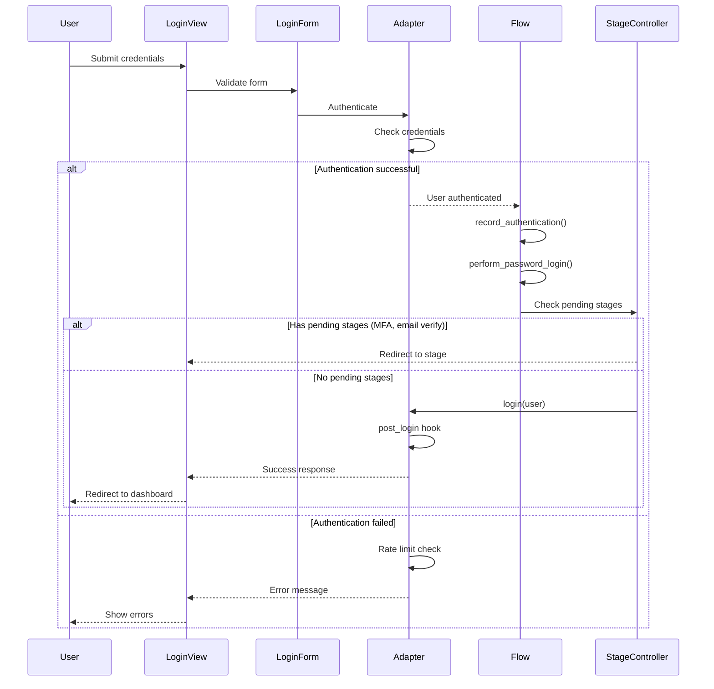
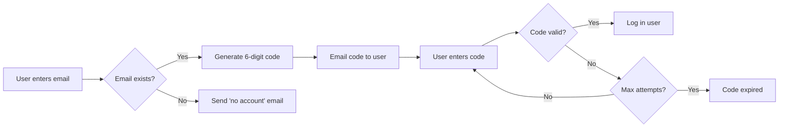
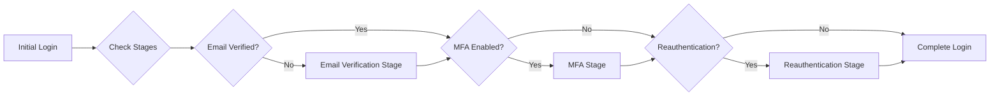
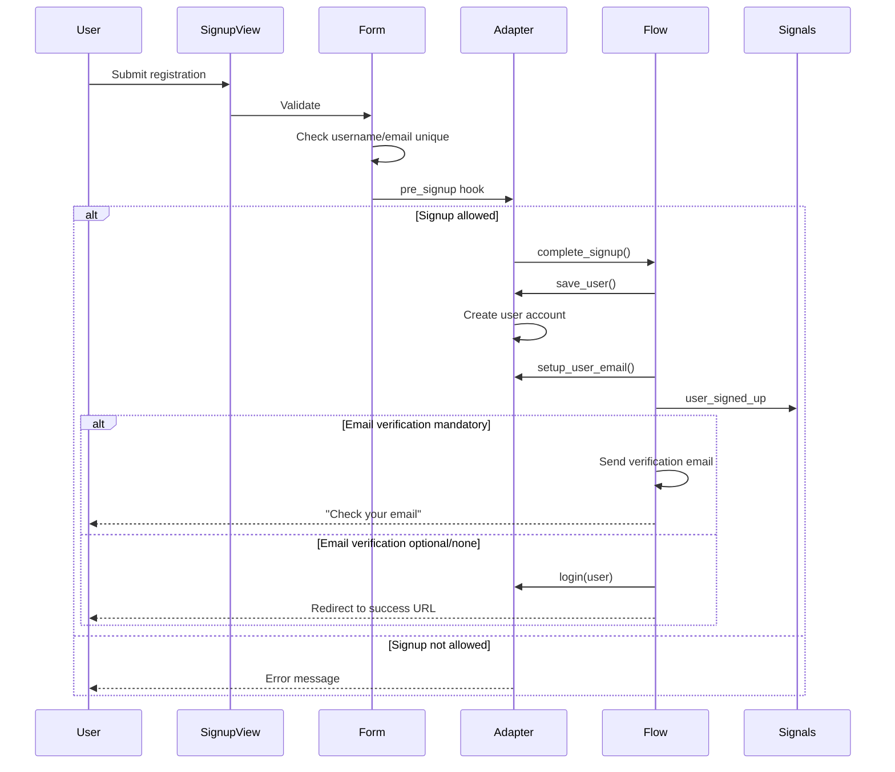
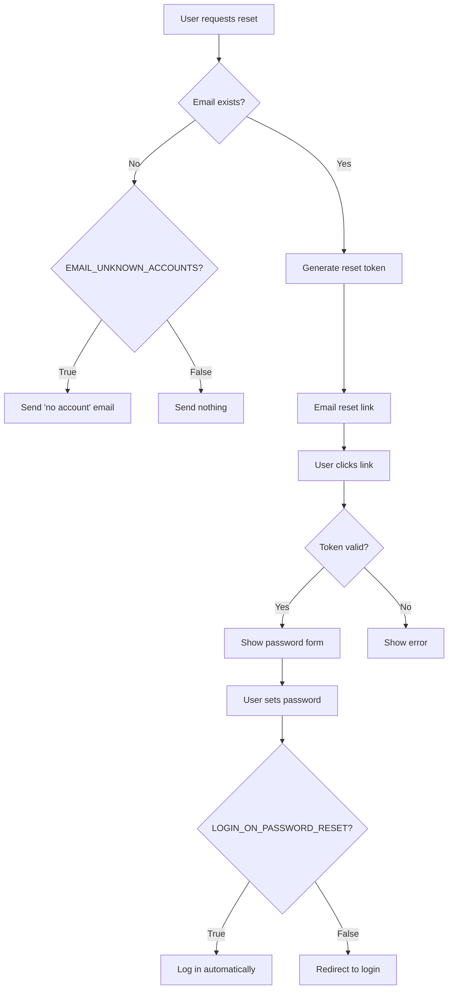

## Overview

django-allauth implements sophisticated authentication flows that handle complex multi-step processes. These flows coordinate between forms, adapters, models, and stages to provide secure, flexible authentication experiences.

<Info>
Flows are internal orchestration logic in `allauth.account.internal.flows` that manage the complex dance between different authentication steps.
</Info>

## The Login Flow

### Standard Login Process



### Login Methods

django-allauth supports multiple login methods that can be mixed and matched:

<Tabs>
  <Tab title="Email Only">
    ```python
    # settings.py
    ACCOUNT_LOGIN_METHODS = {"email"}
    ```
    
    Users log in with their email address and password. The login form shows an email field.
    
    **From source (`forms.py:75`):**
    ```python
    if app_settings.LOGIN_METHODS == {LoginMethod.EMAIL}:
        login_field = EmailField()
    ```
  </Tab>
  
  <Tab title="Username Only">
    ```python
    # settings.py
    ACCOUNT_LOGIN_METHODS = {"username"}
    ```
    
    Traditional username/password authentication.
    
    **From source (`forms.py:77-85`):**
    ```python
    elif app_settings.LOGIN_METHODS == {LoginMethod.USERNAME}:
        login_widget = forms.TextInput(
            attrs={"placeholder": _("Username"), "autocomplete": "username"}
        )
        login_field = forms.CharField(
            label=_("Username"),
            widget=login_widget,
            max_length=get_username_max_length(),
        )
    ```
  </Tab>
  
  <Tab title="Email or Username">
    ```python
    # settings.py
    ACCOUNT_LOGIN_METHODS = {"email", "username"}
    ```
    
    Flexible login accepting either email or username. The system auto-detects which one the user entered.
    
    **Auto-detection logic (`flows/login.py:130-145`):**
    ```python
    def derive_login_method(login: str) -> LoginMethod:
        if len(app_settings.LOGIN_METHODS) == 1:
            return next(iter(app_settings.LOGIN_METHODS))
        if LoginMethod.EMAIL in app_settings.LOGIN_METHODS:
            try:
                validators.validate_email(login)
                return LoginMethod.EMAIL
            except exceptions.ValidationError:
                pass
        if LoginMethod.PHONE in app_settings.LOGIN_METHODS:
            # Check if it's a phone number
            pass
        return LoginMethod.USERNAME
    ```
  </Tab>
  
  <Tab title="Phone Number">
    ```python
    # settings.py
    ACCOUNT_LOGIN_METHODS = {"phone"}
    ```
    
    Login using phone number and password (requires phone number verification).
  </Tab>
</Tabs>

### Login by Code (Magic Link)

Passwordless authentication via one-time codes sent by email:



**Configuration:**

```python
# settings.py

# Enable login by code
ACCOUNT_LOGIN_BY_CODE_ENABLED = True

# Code expires after 3 minutes
ACCOUNT_LOGIN_BY_CODE_TIMEOUT = 180

# Maximum 3 attempts per code
ACCOUNT_LOGIN_BY_CODE_MAX_ATTEMPTS = 3

# Allow "Trust this browser" (requires MFA app)
ACCOUNT_LOGIN_BY_CODE_TRUST_ENABLED = False

# Require login codes for specific authentication methods
ACCOUNT_LOGIN_BY_CODE_REQUIRED = {"password"}  # or True for all methods
```

<CodeGroup>
```python views.py
from allauth.account.views import RequestLoginCodeView, ConfirmLoginCodeView

urlpatterns = [
    path('accounts/login/code/', RequestLoginCodeView.as_view()),
    path('accounts/login/code/confirm/', ConfirmLoginCodeView.as_view()),
]
```

```html request_code.html
<form method="post">
  
  <input type="email" name="email" placeholder="Enter your email" required>
  <button type="submit">Send Code</button>
</form>
```

```html confirm_code.html
<form method="post">
  
  <input type="text" name="code" placeholder="Enter 6-digit code" required>
  <button type="submit">Log In</button>
</form>
```
</CodeGroup>

### Authentication Recording

django-allauth maintains a session log of all authentication methods used:

**From source (`flows/login.py:19-57`):**

```python
def record_authentication(request, user, method, **extra_data):
    """
    Keeps a log of all authentication methods used within the current session.
    
    Example data:
        {'method': 'password',
         'at': 1701423602.7184925,
         'username': 'john.doe'}
         
        {'method': 'socialaccount',
         'at': 1701423567.6368647,
         'provider': 'amazon',
         'uid': 'amzn1.account.K2LI23KL2LK2'}
         
        {'method': 'mfa',
         'at': 1701423602.6392953,
         'id': 1,
         'type': 'totp'}
    """
    methods = request.session.get(AUTHENTICATION_METHODS_SESSION_KEY, [])
    data = {
        "method": method,
        "at": time.time(),
    }
    for k, v in extra_data.items():
        if v is not None:
            data[k] = v
    methods.append(data)
    request.session[AUTHENTICATION_METHODS_SESSION_KEY] = methods
```

This enables:
- Multi-factor authentication tracking
- Step-up authentication
- Security auditing
- Conditional access based on authentication strength

## Login Stages

Stages allow for multi-step login processes:



### Email Verification Stage

**From source (`stages.py:130-148`):**

```python
class EmailVerificationStage(LoginStage):
    """
    Handles email verification during login process.
    Only active when email verification is mandatory.
    """
    key = LoginStageKey.VERIFY_EMAIL
    urlname = "account_email_verification"
    
    def is_resumable(self, request):
        # Stage is resumable if we're in the process of verifying
        return True
```

When a user with an unverified email tries to log in with `ACCOUNT_EMAIL_VERIFICATION = "mandatory"`, they're redirected to verify their email before fully logging in.

### Login Stage Controller

**From source (`stages.py:56-118`):**

```python
class LoginStageController:
    """
    Orchestrates multi-step login flows.
    Tracks which stages have been completed and which are pending.
    """
    
    def __init__(self, request, login):
        self.request = request
        self.login = login
        self.state = self.login.state.setdefault("stages", {})
    
    def get_pending_stage(self) -> Optional[LoginStage]:
        """Returns the next stage that needs to be completed."""
        ret = None
        stages = self.get_stages()
        for stage in stages:
            if self.is_handled(stage.key):
                continue
            ret = stage
            break
        return ret
    
    def handle(self):
        """Process the next pending stage or complete login."""
        stage = self.get_pending_stage()
        if stage:
            self.set_current(stage.key)
            response, continue_flow = stage.handle()
            if not continue_flow:
                return response
            if response:
                return response
        return None
```

### Login Timeout

Limit how long multi-step login can take:

```python
# settings.py
ACCOUNT_LOGIN_TIMEOUT = 900  # 15 minutes (default)
```

This prevents users from starting login, getting stuck at MFA, and returning hours later. After timeout, they must start over.

## The Signup Flow

### Complete Signup Process



### Enumeration Prevention

<Warning>
**Enumeration attacks** allow attackers to discover which email addresses have accounts by observing different responses for existing vs. non-existing emails.
</Warning>

django-allauth prevents this by default:

```python
# settings.py
ACCOUNT_PREVENT_ENUMERATION = True  # Default
```

**How it works:**

<Tabs>
  <Tab title="Signup">
    When `ACCOUNT_EMAIL_VERIFICATION = "mandatory"`:
    
    1. User signs up with email already in use
    2. **No error shown** to user
    3. System sends "account already exists" email to that address
    4. User sees same "check your email" message
    
    ✅ Attacker cannot tell if email was already registered
    
    **From source (`configuration.rst:35-45`):**
    > Whether or not enumeration can be prevented during signup depends on the email
    > verification method. In case of mandatory verification, enumeration can be
    > properly prevented because the case where an email address is already taken is
    > indistinguishable from the case where it is not.
  </Tab>
  
  <Tab title="Password Reset">
    1. User requests password reset for any email
    2. **Always shows** "If that email exists, we sent a link"
    3. If email exists: send password reset email
    4. If email doesn't exist: send "no account found" email (optional)
    
    **Configuration:**
    ```python
    # Send email even if account doesn't exist
    ACCOUNT_EMAIL_UNKNOWN_ACCOUNTS = True
    ```
  </Tab>
  
  <Tab title="Strict Mode">
    With `ACCOUNT_PREVENT_ENUMERATION = "strict"`:
    
    - **Allows multiple accounts with same email** (only one can be verified)
    - Prevents all enumeration leaks
    - Trade-off: less user-friendly
    
    Use when security is paramount over UX.
  </Tab>
</Tabs>

### Signup Hooks

Customize signup behavior with adapter hooks:

```python
from allauth.account.adapter import DefaultAccountAdapter

class MyAccountAdapter(DefaultAccountAdapter):
    
    def is_open_for_signup(self, request):
        """Control if signups are allowed."""
        # Only allow signups with valid invitation
        return 'invite_code' in request.session
    
    def pre_signup(self, request, form):
        """Called before user is saved."""
        # Validate invite code
        invite_code = request.session.get('invite_code')
        if not InviteCode.objects.filter(code=invite_code, used=False).exists():
            raise forms.ValidationError("Invalid invitation code")
    
    def save_user(self, request, user, form, commit=True):
        """Customize user creation."""
        user = super().save_user(request, user, form, commit=False)
        
        # Extract data from invitation
        invite = InviteCode.objects.get(code=request.session['invite_code'])
        user.organization = invite.organization
        user.role = invite.role
        
        if commit:
            user.save()
            invite.mark_used()
        
        return user
    
    def get_signup_redirect_url(self, request):
        """Custom redirect after signup."""
        # Send new users to onboarding
        return reverse('onboarding:welcome')
```

## Password Reset Flow

### Reset Process



### Reset Methods

<Tabs>
  <Tab title="Link-Based (Default)">
    User receives email with a link containing a token.
    
    ```python
    # settings.py
    ACCOUNT_PASSWORD_RESET_BY_CODE_ENABLED = False  # Default
    ```
    
    **Token Generator:**
    
    The default token generator includes email addresses in the hash, so the token becomes invalid if the user's email changes:
    
    **From source (`forms.py:39-49`):**
    ```python
    class EmailAwarePasswordResetTokenGenerator(PasswordResetTokenGenerator):
        def _make_hash_value(self, user, timestamp):
            ret = super()._make_hash_value(user, timestamp)
            sync_user_email_address(user)
            email = user_email(user)
            emails = set([email] if email else [])
            emails.update(
                EmailAddress.objects.filter(user=user).values_list("email", flat=True)
            )
            ret += "|".join(sorted(emails))
            return ret
    ```
  </Tab>
  
  <Tab title="Code-Based">
    User receives email with a 6-digit code to enter manually.
    
    ```python
    # settings.py
    ACCOUNT_PASSWORD_RESET_BY_CODE_ENABLED = True
    ACCOUNT_PASSWORD_RESET_BY_CODE_MAX_ATTEMPTS = 3
    ACCOUNT_PASSWORD_RESET_BY_CODE_TIMEOUT = 180  # 3 minutes
    ```
    
    **Advantages:**
    - Works better on mobile (no link clicking)
    - Code is easier to share if needed
    - Session-based (more secure)
    
    **Disadvantages:**
    - User must type code manually
    - Shorter timeout (typically 3 minutes vs. 3 days)
  </Tab>
</Tabs>

### Custom Token Generator

Implement custom password reset token logic:

```python
from django.contrib.auth.tokens import PasswordResetTokenGenerator

class MyPasswordResetTokenGenerator(PasswordResetTokenGenerator):
    def _make_hash_value(self, user, timestamp):
        """
        Include additional user fields in token hash.
        Token becomes invalid if these fields change.
        """
        hash_value = super()._make_hash_value(user, timestamp)
        
        # Invalidate token if user's 2FA status changes
        hash_value += str(user.has_mfa_enabled)
        
        # Invalidate token if user's phone number changes
        hash_value += str(user.phone_number)
        
        return hash_value

# settings.py
ACCOUNT_PASSWORD_RESET_TOKEN_GENERATOR = \
    'myapp.tokens.MyPasswordResetTokenGenerator'
```

## Login State Management

### The Login Model

**From source (`models.py`):**

```python
class Login:
    """
    Represents a login in progress.
    Stored in the session during multi-step login flows.
    """
    user: Optional[AbstractBaseUser]
    email: Optional[str]
    phone: Optional[str]
    signup: bool
    redirect_url: Optional[str]
    state: Dict  # Stores stage progress
    email_verification: EmailVerificationMethod
    signal_kwargs: Dict
```

This model tracks:
- **Which user** is logging in (or `None` if not yet authenticated)
- **What stages** have been completed
- **Where to redirect** after successful login
- **Whether this is a signup** or regular login

### Session Storage

Login state is stashed in the session during multi-step flows:

```python
# Internal implementation
from allauth.account.internal.stagekit import stash_login, unstash_login

# Store login state
stash_login(request, login)

# Retrieve login state
login = unstash_login(request, peek=True)  # Don't remove from session
login = unstash_login(request)  # Remove from session
```

## Redirects After Authentication

### Login Redirects

```python
# settings.py
from django.urls import reverse_lazy

# Django's setting (used as fallback)
LOGIN_REDIRECT_URL = '/dashboard/'

# Redirect authenticated users trying to access login page
ACCOUNT_AUTHENTICATED_LOGIN_REDIRECTS = True  # Default
```

**Redirect priority:**

1. `next` parameter in URL: `?next=/profile/`
2. Adapter's `get_login_redirect_url()` method
3. `LOGIN_REDIRECT_URL` setting

**Custom adapter:**

```python
from allauth.account.adapter import DefaultAccountAdapter

class MyAccountAdapter(DefaultAccountAdapter):
    def get_login_redirect_url(self, request):
        """
        Determine where to redirect after login based on user role.
        """
        user = request.user
        
        if user.is_staff:
            return reverse('admin:index')
        elif user.profile.is_premium:
            return reverse('premium:dashboard')
        elif not user.profile.is_complete:
            return reverse('profile:complete')
        else:
            return reverse('home')
```

### Signup Redirects

```python
# settings.py
ACCOUNT_SIGNUP_REDIRECT_URL = None  # Uses LOGIN_REDIRECT_URL if None
```

<Note>
Users are only redirected to `SIGNUP_REDIRECT_URL` if signup completed **without interruptions** (e.g., no email verification step).
</Note>

### Logout Redirects

```python
# settings.py
ACCOUNT_LOGOUT_REDIRECT_URL = '/'  # Default

# Allow logout via GET (not recommended)
ACCOUNT_LOGOUT_ON_GET = False  # Default (require POST)
```

## Rate Limiting in Flows

Rate limits are enforced at key points in authentication flows:

```python
# settings.py
ACCOUNT_RATE_LIMITS = {
    # Login attempts
    "login": "30/m/ip",  # 30 per minute per IP
    
    # Failed login attempts (triggers lockout)
    "login_failed": "10/m/ip,5/5m/key",  # Per IP and per username/email
    
    # Signup
    "signup": "20/m/ip",
    
    # Password reset request
    "reset_password": "20/m/ip,5/m/key",
    
    # Password reset submission
    "reset_password_from_key": "20/m/ip",
    
    # Login code request
    "request_login_code": "20/m/ip,3/m/key",
}
```

**From source (`flows/login.py:120-127`):**

```python
def is_login_rate_limited(request, login: Login) -> bool:
    """
    Check if login is rate limited.
    Includes verification rate limits for mandatory email verification.
    """
    from allauth.account.internal.flows.email_verification import (
        is_verification_rate_limited,
    )
    
    if is_verification_rate_limited(request, login):
        return True
    return False
```

## Advanced Flow Customization

### Custom Login Flow

```python
from allauth.account.views import LoginView as AllauthLoginView
from allauth.account.internal.flows.login import perform_login

class CustomLoginView(AllauthLoginView):
    
    def form_valid(self, form):
        """Override to add custom login logic."""
        # Get login instance
        login = form.login
        
        # Check if user is from banned IP
        if is_ip_banned(self.request):
            return self.form_invalid(form)
        
        # Log login attempt
        LoginAttempt.objects.create(
            user=login.user,
            ip=get_client_ip(self.request),
            success=True
        )
        
        # Continue with normal flow
        return perform_login(self.request, login)
```

### Custom Signup Flow

```python
from allauth.account.views import SignupView as AllauthSignupView
from allauth.account.internal.flows.signup import complete_signup

class CustomSignupView(AllauthSignupView):
    
    def form_valid(self, form):
        """Override to add custom signup logic."""
        # Validate invitation code
        invite_code = self.request.session.get('invite_code')
        if not invite_code:
            form.add_error(None, "Signup requires an invitation code")
            return self.form_invalid(form)
        
        # Create user
        user = form.save(self.request)
        
        # Complete signup with custom redirect
        return complete_signup(
            self.request,
            user=user,
            email_verification=app_settings.EMAIL_VERIFICATION,
            redirect_url='/onboarding/',
        )
```

## Next Steps

<CardGroup cols={2}>
  <Card title="Email Verification" icon="envelope-circle-check" href="/concepts/email-verification">
    Deep dive into email verification flows and strategies
  </Card>
  
  <Card title="Rate Limiting" icon="gauge-high" href="/concepts/rate-limiting">
    Configure rate limits to protect authentication endpoints
  </Card>
</CardGroup>
