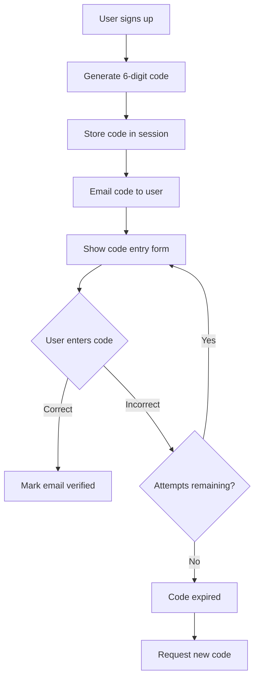
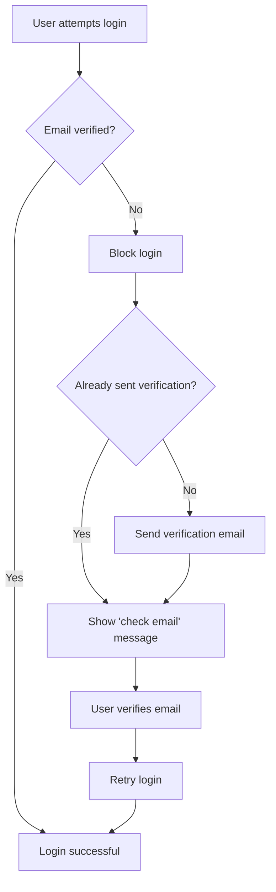

## Overview

Email verification is a critical security feature that confirms users own the email addresses they register with. django-allauth provides flexible email verification with multiple strategies to balance security and user experience.

<Info>
Email verification prevents users from registering with email addresses they don't control, which could be used for spam, impersonation, or account takeover.
</Info>

## Verification Methods

django-allauth offers three main verification approaches:

<Tabs>
  <Tab title="Mandatory">
    **Most Secure** - Users cannot log in until email is verified.
    
    ```python
    # settings.py
    ACCOUNT_EMAIL_VERIFICATION = "mandatory"
    ```
    
    **Flow:**
    ```mermaid
    sequenceDiagram
        participant User
        participant App
        participant Email
        
        User->>App: Sign up
        App->>Email: Send verification email
        App-->>User: "Check your email"
        User->>Email: Click link/enter code
        Email->>App: Verify token
        App->>App: Mark email verified
        App-->>User: "Email verified - you can now log in"
    ```
    
    <Check>Best for applications handling sensitive data</Check>
    <Check>Prevents fake accounts effectively</Check>
    <Warning>Users may abandon signup if they don't receive email</Warning>
  </Tab>
  
  <Tab title="Optional">
    **Balanced Approach** - Verification email sent but login allowed.
    
    ```python
    # settings.py
    ACCOUNT_EMAIL_VERIFICATION = "optional"
    ```
    
    **Flow:**
    ```mermaid
    sequenceDiagram
        participant User
        participant App
        participant Email
        
        User->>App: Sign up
        App->>Email: Send verification email
        App->>App: Log user in immediately
        App-->>User: Redirect to dashboard
        
        Note over User,Email: User can use app while unverified
        
        User->>Email: (Later) Click verification link
        Email->>App: Verify token
        App->>App: Mark email verified
        App-->>User: "Email verified!"
    ```
    
    <Check>Better conversion rates</Check>
    <Check>Users can access app immediately</Check>
    <Info>Restrict sensitive features until verified</Info>
  </Tab>
  
  <Tab title="None">
    **No Verification** - No verification emails sent.
    
    ```python
    # settings.py
    ACCOUNT_EMAIL_VERIFICATION = "none"
    ```
    
    <Warning>
    Only use for testing environments or closed systems where email validity isn't critical.
    </Warning>
    
    Use cases:
    - Internal tools with SSO
    - Development/staging environments
    - Applications that don't use email communication
  </Tab>
</Tabs>

## Verification Delivery Methods

### Link-Based Verification (Default)

Users click a link in their email to verify:

```python
# settings.py
ACCOUNT_EMAIL_VERIFICATION_BY_CODE_ENABLED = False  # Default
```

**Email example:**

```html
Hello {{ user.username }},

Please confirm your email address by clicking the link below:

{{ verification_url }}

This link will expire in 3 days.
```

**Features:**
- ✅ Works in all email clients
- ✅ One-click verification
- ✅ Longer expiration (default: 3 days)
- ✅ No typing required

**Configuration:**

```python
# settings.py

# Token expiration
ACCOUNT_EMAIL_CONFIRMATION_EXPIRE_DAYS = 3

# Use HMAC tokens (stateless, more secure)
ACCOUNT_EMAIL_CONFIRMATION_HMAC = True  # Default

# Allow verification via GET request
ACCOUNT_CONFIRM_EMAIL_ON_GET = False  # Default (requires POST for safety)
```

<Warning>
Setting `ACCOUNT_CONFIRM_EMAIL_ON_GET = True` allows email verification via GET request, which violates HTTP semantics (GET shouldn't modify state). Only enable if absolutely necessary for compatibility.
</Warning>

### Code-Based Verification

Users manually enter a 6-digit code from their email:

```python
# settings.py
ACCOUNT_EMAIL_VERIFICATION_BY_CODE_ENABLED = True
ACCOUNT_EMAIL_VERIFICATION_BY_CODE_MAX_ATTEMPTS = 3
ACCOUNT_EMAIL_VERIFICATION_BY_CODE_TIMEOUT = 900  # 15 minutes
```

**Email example:**

```html
Hello {{ user.username }},

Your verification code is:

    123456

This code expires in 15 minutes.
```

**Features:**
- ✅ Better for mobile users (no link clicking needed)
- ✅ More secure (session-based, shorter timeout)
- ✅ Works even if link clicked on different device
- ⚠️ Requires manual typing
- ⚠️ Shorter expiration time

**Flow:**



**From source (`app_settings.py:102-111`):**

```python
@property
def EMAIL_VERIFICATION_BY_CODE_ENABLED(self):
    return self._setting("EMAIL_VERIFICATION_BY_CODE_ENABLED", False)

@property
def EMAIL_VERIFICATION_BY_CODE_MAX_ATTEMPTS(self):
    return self._setting("EMAIL_VERIFICATION_BY_CODE_MAX_ATTEMPTS", 3)

@property
def EMAIL_VERIFICATION_BY_CODE_TIMEOUT(self):
    return self._setting("EMAIL_VERIFICATION_BY_CODE_TIMEOUT", 15 * 60)
```

## Advanced Verification Features

### Change Email During Verification

Allow users to correct their email if they made a typo:

```python
# settings.py

# Allow changing email during verification
ACCOUNT_EMAIL_VERIFICATION_MAX_CHANGE_COUNT = 2  # Or True/False

# Old boolean setting (deprecated)
# ACCOUNT_EMAIL_VERIFICATION_SUPPORTS_CHANGE = True
```

**Values:**
- `0` or `False` - Cannot change email
- `2` or `True` - Can change up to 2 times
- Any integer - Custom limit

<Warning>
**Enumeration risk:** With enumeration prevention enabled, changing email during verification has limitations. See source (`configuration.rst:243-249`):

> If enumeration prevention is turned on, no account is created when a user signs up using an already existing email. If the user then were able to change to a new email address that is not taken, we would have to create an account as we did not do so yet. Currently, this is not implemented.
</Warning>

### Resend Verification Email

Allow users to request a new verification email/code:

```python
# settings.py

# Allow resending verification
ACCOUNT_EMAIL_VERIFICATION_MAX_RESEND_COUNT = 2  # Or True/False

# Old boolean setting (deprecated)
# ACCOUNT_EMAIL_VERIFICATION_SUPPORTS_RESEND = True
```

**Implementation:**

```python
from allauth.account.internal.flows.email_verification import (
    send_verification_email_to_address
)
from allauth.account.models import EmailAddress

def resend_verification(request):
    """Resend verification email to user's primary email."""
    email_address = EmailAddress.objects.get_primary(request.user)
    
    if email_address and not email_address.verified:
        sent = send_verification_email_to_address(
            request, 
            email_address,
            signup=False
        )
        if sent:
            messages.info(request, "Verification email sent!")
        else:
            messages.error(request, "Please wait before requesting another email.")
```

### Verification Rate Limiting

Prevent abuse of verification email sending:

**From source (`app_settings.py:270-276`):**

```python
if self.EMAIL_VERIFICATION_BY_CODE_ENABLED:
    confirm_email_rl = "1/10s/key"
else:
    cooldown = self._setting("EMAIL_CONFIRMATION_COOLDOWN", 3 * 60)
    confirm_email_rl = None
    if cooldown:
        confirm_email_rl = f"1/{cooldown}s/key"
```

**Configuration:**

```python
# settings.py
ACCOUNT_RATE_LIMITS = {
    # For code-based: max 1 per 10 seconds per email
    "confirm_email": "1/10s/key",
    
    # For link-based: max 1 per 3 minutes per email
    # Controlled by ACCOUNT_EMAIL_CONFIRMATION_COOLDOWN
}

# Deprecated setting (still works)
ACCOUNT_EMAIL_CONFIRMATION_COOLDOWN = 180  # 3 minutes
```

**Hard vs. Soft Rate Limiting:**

**From source (`flows/email_verification.py:169-187`):**

```python
def handle_verification_email_rate_limit(
    request, email: str, raise_exception: bool = False
) -> bool:
    """
    For email verification by link, it is not an issue if the user runs into rate
    limits. The reason is that the link is session independent. Therefore, if the
    user hits rate limits, we can just silently skip sending additional
    verification emails, as the previous emails that were already sent still
    contain valid links. This is different from email verification by code. Here,
    the session contains a specific code, meaning, silently skipping new
    verification emails is not an option, and we must hard fail (429) instead.
    """
    rl_ok = consume_email_verification_rate_limit(
        request, email, raise_exception=raise_exception
    )
    if not rl_ok and app_settings.EMAIL_VERIFICATION_BY_CODE_ENABLED:
        raise ImmediateHttpResponse(respond_429(request))
    return rl_ok
```

<Info>
**Link-based:** Rate limit failures are silent (old link still works)  
**Code-based:** Rate limit failures return HTTP 429 (new code needed)
</Info>

## Email Address Model

### Model Structure

**From source (`models.py:20-54`):**

```python
class EmailAddress(models.Model):
    user = models.ForeignKey(
        settings.AUTH_USER_MODEL,
        verbose_name=_("user"),
        on_delete=models.CASCADE,
    )
    email = models.EmailField(
        db_index=True,
        max_length=app_settings.EMAIL_MAX_LENGTH,
        verbose_name=_("email address"),
    )
    verified = models.BooleanField(verbose_name=_("verified"), default=False)
    primary = models.BooleanField(verbose_name=_("primary"), default=False)
    
    class Meta:
        unique_together = [("user", "email")]
        constraints = [
            # Each user can have only one primary email
            UniqueConstraint(
                fields=["user", "primary"],
                name="unique_primary_email",
                condition=Q(primary=True),
            )
        ]
        # If ACCOUNT_UNIQUE_EMAIL = True
        if app_settings.UNIQUE_EMAIL:
            constraints.append(
                # Only one user can have a verified email
                UniqueConstraint(
                    fields=["email"],
                    name="unique_verified_email",
                    condition=Q(verified=True)
                )
            )
```

### Key Methods

<AccordionGroup>
  <Accordion title="set_verified()" icon="circle-check">
    Mark an email as verified.
    
    **From source (`models.py:75-82`):**
    ```python
    def set_verified(self, commit=True):
        """Mark email as verified if no conflicts exist."""
        if self.verified:
            return True
        if self.can_set_verified():
            self.verified = True
            if commit:
                self.save(update_fields=["verified"])
        return self.verified
    ```
    
    Checks for conflicts (uniqueness constraint) before verifying.
  </Accordion>
  
  <Accordion title="set_as_primary()" icon="star">
    Set email as primary for the user.
    
    **From source (`models.py:84-99`):**
    ```python
    def set_as_primary(self, conditional=False):
        """
        Marks the email address as primary. In case of `conditional`, it is
        only marked as primary if there is no other primary email address set.
        """
        old_primary = EmailAddress.objects.get_primary(self.user)
        if old_primary:
            if conditional:
                return False
            old_primary.primary = False
            old_primary.save()
        self.primary = True
        self.save()
        user_email(self.user, self.email, commit=True)
        return True
    ```
    
    Also syncs with User model's email field.
  </Accordion>
  
  <Accordion title="send_confirmation()" icon="envelope">
    Send verification email for this address.
    
    **From source (`models.py:101-105`):**
    ```python
    def send_confirmation(self, request=None, signup=False):
        """Send verification email."""
        model = get_emailconfirmation_model()
        confirmation = model.create(self)
        confirmation.send(request, signup=signup)
        return confirmation
    ```
  </Accordion>
  
  <Accordion title="remove()" icon="trash">
    Delete email and update user model.
    
    **From source (`models.py:107-121`):**
    ```python
    def remove(self):
        """Remove email address and sync User model."""
        self.delete()
        if user_email(self.user) == self.email:
            # Find alternative email
            alt = (
                EmailAddress.objects.filter(user=self.user)
                .order_by("-verified")
                .first()
            )
            alt_email = ""
            if alt:
                alt_email = alt.email
            user_email(self.user, alt_email, commit=True)
    ```
  </Accordion>
</AccordionGroup>

### Manager Methods

```python
from allauth.account.models import EmailAddress

# Get primary email
primary = EmailAddress.objects.get_primary(user)

# Get specific email for user
email = EmailAddress.objects.get_for_user(user, 'test@example.com')

# Check if email exists for user
exists = EmailAddress.objects.filter(
    user=user, 
    email='test@example.com'
).exists()

# Get all verified emails
verified = EmailAddress.objects.filter(user=user, verified=True)
```

## Email Confirmation Tokens

### HMAC-Based Tokens (Default)

**From source (`app_settings.py:468-469`):**

```python
@property
def EMAIL_CONFIRMATION_HMAC(self):
    return self._setting("EMAIL_CONFIRMATION_HMAC", True)
```

**Advantages:**
- ✅ **Stateless** - No database records needed
- ✅ **Scalable** - No cleanup jobs required
- ✅ **Secure** - Uses Django's signing framework
- ✅ **Performant** - No database queries to verify

**From source (`configuration.rst:204-209`):**

> In previous versions, a record was stored in the database for each ongoing email confirmation, keeping track of these keys. Current versions use HMAC based keys that do not require server side state.

### Database-Based Tokens (Legacy)

```python
# settings.py
ACCOUNT_EMAIL_CONFIRMATION_HMAC = False
```

Creates `EmailConfirmation` records:

**From source (`models.py:136-150`):**

```python
class EmailConfirmation(EmailConfirmationMixin, models.Model):
    email_address = models.ForeignKey(
        EmailAddress,
        verbose_name=_("email address"),
        on_delete=models.CASCADE,
    )
    created = models.DateTimeField(verbose_name=_("created"), default=timezone.now)
    sent = models.DateTimeField(verbose_name=_("sent"), null=True)
    key = models.CharField(verbose_name=_("key"), max_length=64, unique=True)
```

<Note>
Only needed if you require database records for auditing or have specific compliance requirements.
</Note>

## Verification During Login

### Mandatory Verification Blocking

When `ACCOUNT_EMAIL_VERIFICATION = "mandatory"`:



**From source (`flows/email_verification.py:281-308`):**

```python
def send_verification_email_at_login(request: HttpRequest, login: Login) -> bool:
    """
    At this point, it has already been confirmed that email verification
    is needed.
    
    Email verification mails are sent:
    a) Explicitly: when a user signs up
    b) Implicitly: when a user attempts to log in using an unverified
    email while EMAIL_VERIFICATION is mandatory.
    """
    if not login.user:
        sent = send_verification_email_at_fake_login(request, login)
    else:
        sent = send_verification_email_at_real_login(request, login)
    return sent
```

### Auto-Login After Verification

Log users in automatically after they verify their email:

```python
# settings.py
ACCOUNT_LOGIN_ON_EMAIL_CONFIRMATION = True
```

<Warning>
This only works when:
1. User is verifying immediately after signup
2. Browser session is still active
3. Using link-based verification (not code-based)
</Warning>

**Security considerations from source (`flows/email_verification.py:108-147`):**

```python
def login_on_verification(request, email_address) -> Optional[HttpResponse]:
    """
    Simply logging in the user may become a security issue. If you
    do not take proper care (e.g. don't purge used email
    confirmations), a malicious person that got hold of the link
    will be able to login over and over again and the user is
    unable to do anything about it. Even restoring their own mailbox
    security will not help, as the links will still work.
    
    All in all, we only login on verification when the user that is in the
    process of signing up is present in the session to avoid all of the above.
    This may not 100% work in case the user closes the browser (and the session
    gets lost), but at least we're secure.
    """
```

## Custom Verification URLs

### Frontend Verification URLs

Redirect to your frontend application for email verification:

```python
# settings.py
HEADLESS_FRONTEND_URLS = {
    "account_confirm_email": "https://app.example.com/verify-email/{key}",
}
```

The `{key}` placeholder is replaced with the actual verification token.

### Custom URL Construction

Override URL generation in adapter:

```python
from allauth.account.adapter import DefaultAccountAdapter
from allauth.account.internal.flows.email_verification import (
    get_email_verification_url
)

class MyAccountAdapter(DefaultAccountAdapter):
    
    def get_email_confirmation_url(self, request, emailconfirmation):
        """
        Customize verification URL.
        Called when sending verification emails.
        """
        # Use custom domain for verification
        key = emailconfirmation.key
        return f"https://verify.example.com/confirm/{key}"
```

## Email Templates

### Default Templates

django-allauth includes templates for verification emails:

```
allauth/templates/account/email/
├── email_confirmation_subject.txt
├── email_confirmation_message.txt
└── email_confirmation_message.html
```

### Customizing Email Content

Override templates in your project:

<CodeGroup>
```django email_confirmation_subject.txt


Verify Your Email Address

```

```django email_confirmation_message.txt


Hello {{ user.username }},

Thank you for signing up at {{ site.name }}!

To complete your registration, please verify your email address by clicking the link below:

{{ activate_url }}

This link will expire in {{ expiration_days }} days.

If you didn't create this account, you can safely ignore this email.

Best regards,
The {{ site.name }} Team

```

```django email_confirmation_message.html

<!DOCTYPE html>
<html>
<head>
    <style>
        body { font-family: Arial, sans-serif; }
        .button { 
            background-color: #007bff; 
            color: white; 
            padding: 12px 24px;
            text-decoration: none;
            border-radius: 4px;
        }
    </style>
</head>
<body>
    <h2>Welcome to {{ site.name }}!</h2>
    
    <p>Hello {{ user.username }},</p>
    
    <p>Thank you for signing up! Please verify your email address to get started.</p>
    
    <p>
        <a href="{{ activate_url }}" class="button">
            Verify Email Address
        </a>
    </p>
    
    <p><small>Or copy and paste this link: {{ activate_url }}</small></p>
    
    <p><small>This link expires in {{ expiration_days }} days.</small></p>
</body>
</html>
```
</CodeGroup>

### Available Template Context

Variables available in verification email templates:

| Variable | Description |
|----------|-------------|
| `user` | User object |
| `activate_url` | Full verification URL |
| `key` | Verification token |
| `site` | Current Site object |
| `request` | HttpRequest (may be None) |
| `expiration_days` | Days until token expires |

## Programmatic Verification

### Verify Email in Code

```python
from allauth.account.models import EmailAddress
from allauth.account.internal.flows.email_verification import verify_email

# Get email address
email_address = EmailAddress.objects.get(
    user=user,
    email='user@example.com'
)

# Verify it
if not email_address.verified:
    success = verify_email(request, email_address)
    if success:
        print("Email verified!")
```

### Indirect Verification

Verify email based on external validation (e.g., OAuth provider):

```python
from allauth.account.internal.flows.email_verification import (
    verify_email_indirectly
)

# User logged in via Google OAuth
# We trust Google's email verification
if provider == 'google':
    verify_email_indirectly(request, user, email='user@gmail.com')
```

## Redirect After Verification

Configure where users go after verifying their email:

```python
# settings.py

# For authenticated users
ACCOUNT_EMAIL_CONFIRMATION_AUTHENTICATED_REDIRECT_URL = '/dashboard/'

# For anonymous users (e.g., clicked link after session expired)
ACCOUNT_EMAIL_CONFIRMATION_ANONYMOUS_REDIRECT_URL = '/accounts/login/'
```

**Default behavior:**

- **Authenticated:** Redirects to `LOGIN_REDIRECT_URL`
- **Anonymous:** Redirects to `LOGIN_URL`

## Signals

Hook into verification events:

<CodeGroup>
```python signals.py
from allauth.account.signals import email_confirmed, email_confirmation_sent
from django.dispatch import receiver

@receiver(email_confirmed)
def on_email_confirmed(sender, request, email_address, **kwargs):
    """
    Called when email is successfully verified.
    """
    user = email_address.user
    
    # Grant access to features
    user.profile.email_verified = True
    user.profile.save()
    
    # Send welcome email
    send_welcome_email(user)
    
    # Track analytics
    analytics.track(user.id, 'Email Verified')

@receiver(email_confirmation_sent)
def on_verification_sent(sender, request, confirmation, signup, **kwargs):
    """
    Called when verification email is sent.
    """
    # Log for monitoring
    logger.info(
        f"Verification email sent",
        extra={
            'email': confirmation.email_address.email,
            'is_signup': signup,
        }
    )
```
</CodeGroup>

## Testing Email Verification

### Console Email Backend

View emails in console during development:

```python
# settings.py (development)
EMAIL_BACKEND = 'django.core.mail.backends.console.EmailBackend'
```

### Disable for Tests

```python
# settings.py (test)
ACCOUNT_EMAIL_VERIFICATION = "none"
```

### Mock Verification

```python
# tests.py
from allauth.account.models import EmailAddress

def test_email_verification():
    # Create user
    user = User.objects.create_user('test', 'test@example.com', 'password')
    
    # Manually mark email as verified
    email = EmailAddress.objects.create(
        user=user,
        email='test@example.com',
        verified=True,
        primary=True
    )
    
    # Test verified user behavior
    assert email.verified
    assert user can access protected features
```

## Best Practices

<AccordionGroup>
  <Accordion title="Choose the Right Method" icon="compass">
    - **Mandatory:** For apps handling sensitive data, financial transactions, or PII
    - **Optional:** For social apps, content platforms, or when UX is critical
    - **None:** Only for internal tools or development
  </Accordion>
  
  <Accordion title="Use Code-Based for Mobile" icon="mobile">
    If your app is mobile-first, code-based verification provides better UX:
    - No link clicking required
    - Works across devices
    - Users stay in your app
  </Accordion>
  
  <Accordion title="Provide Resend Option" icon="rotate">
    Always allow users to request a new verification email:
    ```python
    ACCOUNT_EMAIL_VERIFICATION_MAX_RESEND_COUNT = 3
    ```
  </Accordion>
  
  <Accordion title="Set Reasonable Timeouts" icon="clock">
    Balance security with usability:
    - **Link-based:** 3 days (users might verify later)
    - **Code-based:** 15 minutes (active verification flow)
  </Accordion>
  
  <Accordion title="Monitor Delivery" icon="chart-line">
    Track verification email delivery and completion rates:
    ```python
    @receiver(email_confirmation_sent)
    def track_verification_sent(sender, **kwargs):
        metrics.increment('verification_email_sent')
    
    @receiver(email_confirmed)
    def track_verification_complete(sender, **kwargs):
        metrics.increment('verification_completed')
    ```
  </Accordion>
</AccordionGroup>

## Next Steps

<CardGroup cols={2}>
  <Card title="Account Management" icon="user-gear" href="/concepts/account-management">
    Learn about email address management and multiple emails per user
  </Card>
  
  <Card title="Rate Limiting" icon="gauge-high" href="/concepts/rate-limiting">
    Configure rate limits for verification email sending
  </Card>
</CardGroup>
