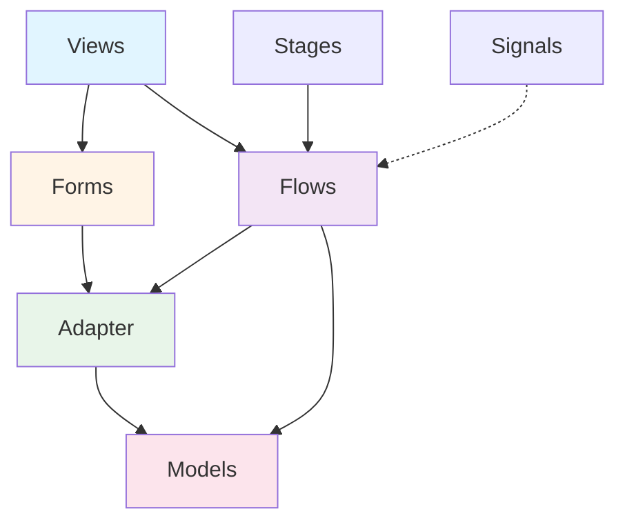
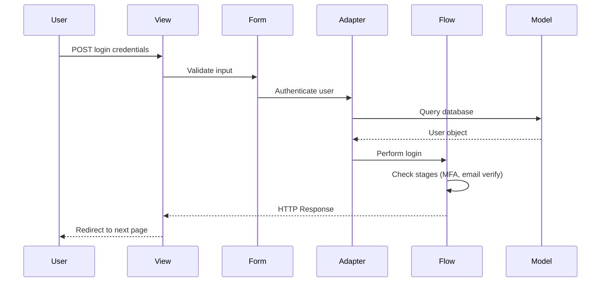
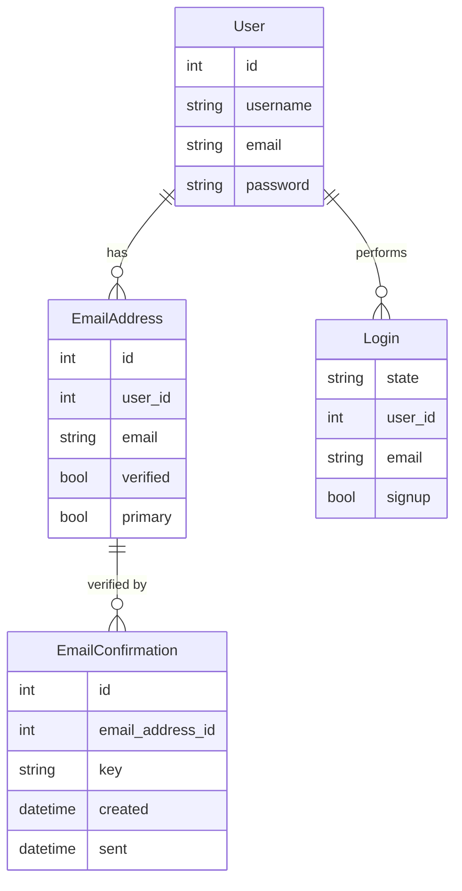

## What is django-allauth?

django-allauth is a comprehensive, integrated authentication solution for Django applications. It provides a complete authentication framework that handles regular accounts (username/email + password) as well as social authentication from providers like Google, GitHub, and dozens of others.

<Info>
django-allauth is designed to be **secure by default**, with built-in protections against enumeration attacks, rate limiting, and comprehensive email verification flows.
</Info>

## Core Features

<CardGroup cols={2}>
  <Card title="Account Management" icon="user">
    Complete user registration, login, password reset, and email management
  </Card>
  <Card title="Email Verification" icon="envelope-circle-check">
    Flexible email verification with both link-based and code-based flows
  </Card>
  <Card title="Social Authentication" icon="users">
    Pre-built integrations with 50+ OAuth providers
  </Card>
  <Card title="Rate Limiting" icon="gauge-high">
    Built-in rate limiting to protect against brute force and abuse
  </Card>
</CardGroup>

## Architecture

django-allauth follows a modular architecture with clear separation of concerns:



### Key Components

<AccordionGroup>
  <Accordion title="Views" icon="eye">
    Handle HTTP request/response cycle for authentication actions. Each view corresponds to a user-facing action like login, signup, or email verification.
    
    ```python
    # Example: Login view
    from allauth.account.views import LoginView
    
    urlpatterns = [
        path('accounts/login/', LoginView.as_view(), name='account_login'),
    ]
    ```
  </Accordion>

  <Accordion title="Forms" icon="rectangle-list">
    Validate and clean user input. Forms are customizable through the `ACCOUNT_FORMS` setting.
    
    ```python
    # settings.py
    ACCOUNT_FORMS = {
        'login': 'myapp.forms.CustomLoginForm',
        'signup': 'myapp.forms.CustomSignupForm',
    }
    ```
  </Accordion>

  <Accordion title="Adapter" icon="plug">
    The adapter pattern allows you to customize core behaviors without modifying allauth code. Override adapter methods to tailor functionality to your needs.
    
    ```python
    from allauth.account.adapter import DefaultAccountAdapter
    
    class MyAccountAdapter(DefaultAccountAdapter):
        def is_open_for_signup(self, request):
            # Close signups during maintenance
            return not request.site.is_in_maintenance_mode()
    ```
  </Accordion>

  <Accordion title="Models" icon="database">
    Core data models including `EmailAddress` for managing multiple email addresses per user, and `EmailConfirmation` for verification tokens.
    
    ```python
    from allauth.account.models import EmailAddress
    
    # Check if user's email is verified
    email = EmailAddress.objects.get_primary(user)
    if email and email.verified:
        print("Email is verified!")
    ```
  </Accordion>

  <Accordion title="Flows" icon="diagram-project">
    Internal orchestration logic that coordinates between different components. Flows handle complex multi-step processes like signup with email verification.
  </Accordion>

  <Accordion title="Stages" icon="stairs">
    Login stages allow for multi-step login processes. Examples include email verification stage, MFA stage, and password reset stage.
  </Accordion>

  <Accordion title="Signals" icon="satellite-dish">
    Django signals are dispatched at key points allowing you to hook into authentication events.
    
    ```python
    from allauth.account.signals import user_signed_up
    from django.dispatch import receiver
    
    @receiver(user_signed_up)
    def on_user_signup(request, user, **kwargs):
        # Send welcome email, create profile, etc.
        send_welcome_email(user)
    ```
  </Accordion>
</AccordionGroup>

## Authentication Methods

django-allauth supports multiple authentication methods that can be configured independently:

<Tabs>
  <Tab title="Username + Password">
    Traditional authentication using a username and password.
    
    ```python
    # settings.py
    ACCOUNT_LOGIN_METHODS = {"username"}
    ACCOUNT_SIGNUP_FIELDS = ['username*', 'password1*', 'password2*']
    ```
  </Tab>
  
  <Tab title="Email + Password">
    Modern approach using email address as the primary identifier.
    
    ```python
    # settings.py
    ACCOUNT_LOGIN_METHODS = {"email"}
    ACCOUNT_SIGNUP_FIELDS = ['email*', 'password1*', 'password2*']
    ACCOUNT_EMAIL_VERIFICATION = "mandatory"
    ```
  </Tab>
  
  <Tab title="Email or Username">
    Flexible approach allowing users to log in with either.
    
    ```python
    # settings.py
    ACCOUNT_LOGIN_METHODS = {"email", "username"}
    ACCOUNT_SIGNUP_FIELDS = ['username*', 'email*', 'password1*', 'password2*']
    ```
  </Tab>
  
  <Tab title="Magic Code Login">
    Passwordless authentication via one-time codes sent to email.
    
    ```python
    # settings.py
    ACCOUNT_LOGIN_BY_CODE_ENABLED = True
    ACCOUNT_LOGIN_BY_CODE_TIMEOUT = 180  # 3 minutes
    ACCOUNT_LOGIN_BY_CODE_MAX_ATTEMPTS = 3
    ```
  </Tab>
</Tabs>

## Configuration Philosophy

django-allauth is designed to be **secure and usable by default**. Key configuration principles:

<Steps>
  <Step title="Security First">
    Rate limiting, enumeration prevention, and email verification are enabled by default to protect your application and users.
  </Step>
  
  <Step title="Progressive Disclosure">
    Start with sensible defaults and customize only what you need. Most apps can get started with minimal configuration.
  </Step>
  
  <Step title="Adapter Customization">
    Use the adapter pattern instead of forking code. Override specific methods to change behavior while maintaining compatibility with updates.
  </Step>
</Steps>

## Common Configuration Patterns

### Basic Email-Based Authentication

```python
# settings.py
INSTALLED_APPS = [
    # ...
    'django.contrib.sites',
    'allauth',
    'allauth.account',
]

SITE_ID = 1

# Authentication methods
ACCOUNT_LOGIN_METHODS = {"email"}
ACCOUNT_EMAIL_REQUIRED = True
ACCOUNT_USERNAME_REQUIRED = False

# Email verification
ACCOUNT_EMAIL_VERIFICATION = "mandatory"
ACCOUNT_EMAIL_CONFIRMATION_EXPIRE_DAYS = 3

# Security
ACCOUNT_PREVENT_ENUMERATION = True
ACCOUNT_RATE_LIMITS = {
    "login_failed": "5/5m/key",
    "signup": "20/m/ip",
}
```

### Username-Based with Optional Email

```python
# settings.py
ACCOUNT_LOGIN_METHODS = {"username"}
ACCOUNT_SIGNUP_FIELDS = ['username*', 'email', 'password1*', 'password2*']
ACCOUNT_EMAIL_VERIFICATION = "optional"
ACCOUNT_USERNAME_MIN_LENGTH = 3
ACCOUNT_USERNAME_BLACKLIST = ['admin', 'root', 'system']
```

## Email Verification Methods

<CardGroup cols={3}>
  <Card title="Mandatory" icon="lock">
    Users cannot log in until email is verified. Most secure option.
    
    ```python
    ACCOUNT_EMAIL_VERIFICATION = "mandatory"
    ```
  </Card>
  
  <Card title="Optional" icon="envelope">
    Verification email sent but login allowed. Balances security and UX.
    
    ```python
    ACCOUNT_EMAIL_VERIFICATION = "optional"
    ```
  </Card>
  
  <Card title="None" icon="ban">
    No verification emails sent. Use only for testing or closed systems.
    
    ```python
    ACCOUNT_EMAIL_VERIFICATION = "none"
    ```
  </Card>
</CardGroup>

## Request Lifecycle

Understanding how an authentication request flows through allauth:



<Note>
Each step in this flow can be customized through settings, adapter methods, or by connecting to signals.
</Note>

## Model Relationships



## Security Features

<CardGroup cols={2}>
  <Card title="Enumeration Prevention" icon="user-secret">
    Prevents attackers from discovering which email addresses are registered by giving identical responses for existing and non-existing accounts.
  </Card>
  
  <Card title="Rate Limiting" icon="shield-halved">
    Protects against brute force attacks with configurable rate limits per IP, user, and custom keys.
  </Card>
  
  <Card title="HMAC-Based Tokens" icon="key">
    Email verification uses stateless HMAC tokens instead of database records, improving security and scalability.
  </Card>
  
  <Card title="Session Security" icon="lock">
    Configurable session duration and "Remember Me" functionality with secure cookie settings.
  </Card>
</CardGroup>

## Next Steps

<CardGroup cols={2}>
  <Card title="Account Management" icon="user-gear" href="/concepts/account-management">
    Learn about user registration, profile management, and email handling
  </Card>
  
  <Card title="Authentication Flows" icon="diagram-project" href="/concepts/authentication-flows">
    Understand login, signup, and password reset processes
  </Card>
  
  <Card title="Email Verification" icon="envelope-circle-check" href="/concepts/email-verification">
    Deep dive into email verification strategies and configuration
  </Card>
  
  <Card title="Rate Limiting" icon="gauge-high" href="/concepts/rate-limiting">
    Configure rate limits to protect your application
  </Card>
</CardGroup>

## Key Takeaways

<Check>
django-allauth provides a complete, secure authentication solution out of the box
</Check>

<Check>
The adapter pattern allows deep customization without forking code
</Check>

<Check>
Multiple authentication methods can coexist in the same application
</Check>

<Check>
Security features like rate limiting and enumeration prevention are enabled by default
</Check>

<Check>
Flows and stages orchestrate complex multi-step authentication processes
</Check>
