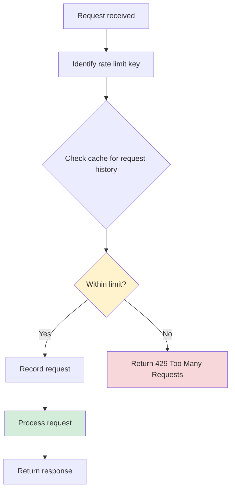

## Overview

Rate limiting is a critical security feature that protects your application from abuse, brute force attacks, and resource exhaustion. django-allauth includes comprehensive rate limiting that's **enabled by default** and requires no external dependencies beyond Django's cache framework.

<Warning>
**Rate limiting requires a proper cache backend.** It will not work correctly with Django's `DummyCache`. Use Redis, Memcached, or database caching in production.
</Warning>

## How Rate Limiting Works

Rate limits restrict the number of times an action can be performed within a time window, tracked per:
- **IP address** - Prevent attacks from specific sources
- **User** - Limit actions per authenticated user
- **Key** - Custom identifier (email, username, phone)



## Rate Limit Syntax

Rate limits use a concise string format:

```
amount/duration/per
```

**Examples:**

```python
"5/m/ip"           # 5 requests per minute per IP
"20/h/user"        # 20 requests per hour per user  
"3/30s/key"        # 3 requests per 30 seconds per key
"10/5m/ip,5/m/key" # Multiple limits (both must pass)
```

**Duration units:**
- `s` - seconds
- `m` - minutes
- `h` - hours
- `d` - days

**Per options:**
- `ip` - Client IP address
- `user` - Authenticated user
- `key` - Action-specific key (email, username, etc.)

## Default Rate Limits

django-allauth ships with sensible defaults configured for security:

**From source (`app_settings.py:260-304`):**

```python
@property
def RATE_LIMITS(self):
    return {
        # Change password view (for users already logged in)
        "change_password": "5/m/user",
        
        # Change phone number
        "change_phone": "1/m/user",
        
        # Email management (e.g. add, remove, change primary)
        "manage_email": "10/m/user",
        
        # Request a password reset, global rate limit per IP
        "reset_password": "20/m/ip,5/m/key",
        
        # Reauthentication for users already logged in
        "reauthenticate": "10/m/user",
        
        # Password reset (the view the password reset email links to)
        "reset_password_from_key": "20/m/ip",
        
        # Signups
        "signup": "20/m/ip",
        
        # Logins
        "login": "30/m/ip",
        
        # Request a login code: key is the email
        "request_login_code": "20/m/ip,3/m/key",
        
        # Failed login attempts
        "login_failed": "10/m/ip,5/5m/key",
        
        # Verify email
        "confirm_email": "1/3m/key",  # or "1/10s/key" for code-based
        
        # Verify phone
        "verify_phone": "1/30s/key,3/m/ip",
    }
```

## Customizing Rate Limits

### Override Specific Limits

Modify individual rate limits while keeping defaults:

```python
# settings.py
ACCOUNT_RATE_LIMITS = {
    # More restrictive login limit
    "login": "10/m/ip",
    
    # Allow more signups per IP (e.g., public WiFi)
    "signup": "50/m/ip",
    
    # Stricter password reset
    "reset_password": "10/m/ip,3/m/key",
    
    # All other limits use defaults
}
```

### Disable Specific Limits

Set to `None` to disable a specific rate limit:

```python
# settings.py
ACCOUNT_RATE_LIMITS = {
    # Disable login rate limiting (not recommended)
    "login": None,
    
    # Disable signup rate limiting (dangerous)
    "signup": None,
}
```

<Warning>
Disabling rate limits significantly increases your application's attack surface. Only do this in controlled environments or with alternative protection mechanisms.
</Warning>

### Disable All Rate Limits

```python
# settings.py
ACCOUNT_RATE_LIMITS = False  # Disables all rate limiting
```

<Note>
Useful for development or when using external rate limiting (e.g., Cloudflare, AWS WAF).
</Note>

## Rate Limit Actions

### Authentication Actions

<AccordionGroup>
  <Accordion title="login" icon="right-to-bracket">
    **Default:** `30/m/ip`
    
    General login attempts (successful or failed).
    
    ```python
    ACCOUNT_RATE_LIMITS = {
        "login": "50/m/ip",  # Allow 50 login attempts per minute
    }
    ```
    
    Applied on every login form submission.
  </Accordion>
  
  <Accordion title="login_failed" icon="triangle-exclamation">
    **Default:** `10/m/ip,5/5m/key`
    
    **Critical for security** - Prevents brute force password attacks.
    
    ```python
    ACCOUNT_RATE_LIMITS = {
        # 10 per minute per IP, 5 per 5 minutes per username/email
        "login_failed": "10/m/ip,5/5m/key",
    }
    ```
    
    When exceeded, users are temporarily locked out even with correct credentials.
    
    <Warning>
    **Important:** This only protects allauth's login view. It does **not** protect Django's admin login. See the [admin protection docs](/common/admin) for securing admin login.
    </Warning>
    
    **From source (`rate_limits.rst:43-47`):**
    > Restricts the allowed number of failed login attempts. When exceeded, the user is prohibited from logging in for the remainder of the rate limit. Important: while this protects the allauth login view, it does not protect Django's admin login from being brute forced.
  </Accordion>
  
  <Accordion title="signup" icon="user-plus">
    **Default:** `20/m/ip`
    
    User registration attempts.
    
    ```python
    ACCOUNT_RATE_LIMITS = {
        "signup": "30/m/ip",
    }
    ```
    
    Prevents automated account creation and spam registrations.
  </Accordion>
  
  <Accordion title="login_by_code" icon="key">
    **Default:** `20/m/ip,3/m/key`
    
    Requesting passwordless login codes.
    
    ```python
    ACCOUNT_LOGIN_BY_CODE_ENABLED = True
    ACCOUNT_RATE_LIMITS = {
        "request_login_code": "10/m/ip,2/m/key",  # Stricter limits
    }
    ```
    
    The `key` is the email address requesting the code.
  </Accordion>
</AccordionGroup>

### Password Actions

<AccordionGroup>
  <Accordion title="reset_password" icon="lock-open">
    **Default:** `20/m/ip,5/m/key`
    
    Requesting password reset emails.
    
    ```python
    ACCOUNT_RATE_LIMITS = {
        "reset_password": "10/m/ip,3/h/key",
    }
    ```
    
    The `key` is the email address for which the reset is requested.
    
    Prevents:
    - Email bombing (spamming user with reset emails)
    - Account enumeration attempts
  </Accordion>
  
  <Accordion title="reset_password_from_key" icon="unlock-keyhole">
    **Default:** `20/m/ip`
    
    Submitting the password reset form (after clicking the link).
    
    ```python
    ACCOUNT_RATE_LIMITS = {
        "reset_password_from_key": "10/m/ip",
    }
    ```
    
    Prevents brute-forcing the new password field.
  </Accordion>
  
  <Accordion title="change_password" icon="key">
    **Default:** `5/m/user`
    
    Changing password for authenticated users.
    
    ```python
    ACCOUNT_RATE_LIMITS = {
        "change_password": "3/h/user",  # Max 3 changes per hour
    }
    ```
    
    Prevents password change abuse if an account is compromised.
  </Accordion>
</AccordionGroup>

### Email Actions

<AccordionGroup>
  <Accordion title="confirm_email" icon="envelope-circle-check">
    **Default:** `1/3m/key` (link) or `1/10s/key` (code)
    
    Sending email verification messages.
    
    ```python
    ACCOUNT_RATE_LIMITS = {
        "confirm_email": "1/5m/key",  # Max 1 per 5 minutes per email
    }
    ```
    
    The `key` is the email address being verified.
    
    **Automatic configuration from source (`app_settings.py:270-276`):**
    ```python
    if self.EMAIL_VERIFICATION_BY_CODE_ENABLED:
        confirm_email_rl = "1/10s/key"
    else:
        cooldown = self._setting("EMAIL_CONFIRMATION_COOLDOWN", 3 * 60)
        confirm_email_rl = f"1/{cooldown}s/key"
    ```
  </Accordion>
  
  <Accordion title="manage_email" icon="at">
    **Default:** `10/m/user`
    
    Email management actions (add, remove, set primary).
    
    ```python
    ACCOUNT_RATE_LIMITS = {
        "manage_email": "20/m/user",
    }
    ```
    
    Prevents rapid-fire email additions/removals.
  </Accordion>
</AccordionGroup>

### Other Actions

<AccordionGroup>
  <Accordion title="reauthenticate" icon="shield-halved">
    **Default:** `10/m/user`
    
    Re-entering credentials for sensitive operations.
    
    ```python
    ACCOUNT_REAUTHENTICATION_REQUIRED = True
    ACCOUNT_RATE_LIMITS = {
        "reauthenticate": "5/m/user",
    }
    ```
  </Accordion>
  
  <Accordion title="change_phone" icon="phone">
    **Default:** `1/m/user`
    
    Changing phone number.
    
    ```python
    ACCOUNT_RATE_LIMITS = {
        "change_phone": "3/h/user",
    }
    ```
  </Accordion>
  
  <Accordion title="verify_phone" icon="mobile">
    **Default:** `1/30s/key,3/m/ip`
    
    Sending phone verification codes.
    
    ```python
    ACCOUNT_RATE_LIMITS = {
        "verify_phone": "1/60s/key,5/m/ip",
    }
    ```
    
    The `key` is the phone number.
  </Accordion>
</AccordionGroup>

## IP Address Detection

<Danger>
**Critical Security Consideration:** Accurate IP detection is essential for rate limiting to work correctly.

django-allauth **cannot reliably determine the client IP address out of the box** because the correct method depends on your infrastructure (load balancers, proxies, CDNs).

The `X-Forwarded-For` header **can be trivially spoofed**, allowing attackers to bypass rate limits entirely.
</Danger>

### Trusted Proxy Configuration

Configure how many proxies are under your control:

```python
# settings.py

# Number of trusted proxies
ALLAUTH_TRUSTED_PROXY_COUNT = 1  # e.g., one load balancer

# Custom IP header from trusted proxy
ALLAUTH_TRUSTED_CLIENT_IP_HEADER = None  # Default
```

**How it works:**

With `ALLAUTH_TRUSTED_PROXY_COUNT = 1`:
- `X-Forwarded-For: client, proxy1, proxy2`
- Takes the IP from position: `count` from the right
- Result: `proxy1` (second from right)

**From source (`rate_limits.rst:36-45`):**

> As the `X-Forwarded-For` header can be spoofed, you need to configure the number of proxies that are under your control and hence, can be trusted. The default is 0, meaning, no proxies are trusted. As a result, the `X-Forwarded-For` header will be disregarded by default.

### Trusted Header Configuration

If your proxy sets a custom header (e.g., Cloudflare, nginx):

```python
# settings.py

# Cloudflare
ALLAUTH_TRUSTED_CLIENT_IP_HEADER = "CF-Connecting-IP"

# nginx
ALLAUTH_TRUSTED_CLIENT_IP_HEADER = "X-Real-IP"

# Custom load balancer
ALLAUTH_TRUSTED_CLIENT_IP_HEADER = "X-Client-IP"
```

<Note>
Only use `ALLAUTH_TRUSTED_CLIENT_IP_HEADER` if you're certain the header is set by a trusted component and cannot be spoofed by clients.
</Note>

### Custom IP Detection

Override the adapter for complex scenarios:

```python
from allauth.account.adapter import DefaultAccountAdapter

class MyAccountAdapter(DefaultAccountAdapter):
    
    def get_client_ip(self, request):
        """
        Custom IP extraction logic.
        
        Example: App behind Cloudflare and then AWS ALB.
        """
        # Trust Cloudflare's CF-Connecting-IP
        cf_ip = request.META.get('HTTP_CF_CONNECTING_IP')
        if cf_ip:
            return cf_ip
        
        # Fallback to X-Forwarded-For with 2 trusted proxies
        x_forwarded_for = request.META.get('HTTP_X_FORWARDED_FOR')
        if x_forwarded_for:
            # Get second IP from the right (after 2 proxies)
            ips = [ip.strip() for ip in x_forwarded_for.split(',')]
            if len(ips) >= 2:
                return ips[-2]
        
        # Ultimate fallback
        return request.META.get('REMOTE_ADDR')

# settings.py
ACCOUNT_ADAPTER = 'myapp.adapters.MyAccountAdapter'
```

### Testing IP Detection

```python
from allauth.account.adapter import get_adapter

def test_ip_detection(request):
    adapter = get_adapter()
    client_ip = adapter.get_client_ip(request)
    print(f"Detected IP: {client_ip}")
    return HttpResponse(f"Your IP: {client_ip}")
```

## Rate Limit Implementation

### Internal Architecture

**From source (`core/internal/ratelimit.py:1-11`):**

```python
"""
Rate limiting in this implementation relies on a cache and uses non-atomic
operations, making it vulnerable to race conditions. As a result, users may
occasionally bypass the intended rate limit due to concurrent access. However,
such race conditions are rare in practice. For example, if the limit is set to
10 requests per minute and a large number of parallel processes attempt to test
that limit, you may occasionally observe slight overruns—such as 11 or 12
requests slipping through. Nevertheless, exceeding the limit by a large margin
is highly unlikely due to the low probability of many processes entering the
critical non-atomic code section simultaneously.
"""
```

<Info>
Rate limiting uses cache-based tracking with non-atomic operations. This means:
- ✅ Performant and scalable
- ✅ No database overhead
- ⚠️ Slight overruns possible under high concurrency (acceptable trade-off)
</Info>

### Cache Key Format

**From source (`core/internal/ratelimit.py:93-117`):**

```python
def get_cache_key(request, *, action: str, rate: Rate, key=None, user=None):
    """Generate cache key for rate limit tracking."""
    source: Tuple[str, ...]
    if rate.per == "ip":
        source = ("ip", get_adapter().get_client_ip(request))
    elif rate.per == "user":
        if user is None:
            if not request.user.is_authenticated:
                raise ImproperlyConfigured(
                    "ratelimit configured per user but used anonymously"
                )
            user = request.user
        source = ("user", str(user.pk))
    elif rate.per == "key":
        if key is None:
            raise ImproperlyConfigured(
                "ratelimit configured per key but no key specified"
            )
        key_hash = hashlib.sha256(key.encode("utf8")).hexdigest()
        source = (key_hash,)
    keys = ["allauth", "rl", action, *source]
    return ":".join(keys)
```

**Example cache keys:**

```
allauth:rl:login:ip:192.168.1.1
allauth:rl:signup:ip:10.0.0.50
allauth:rl:reset_password:key:5f4dcc3b5aa765d61d8327deb882cf99
allauth:rl:change_password:user:123
```

### Consumption Algorithm

**From source (`core/internal/ratelimit.py:120-147`):**

```python
def _consume_single_rate(
    request,
    *,
    action: str,
    rate: Rate,
    key=None,
    user=None,
    dry_run: bool = False,
    raise_exception: bool = False,
) -> Optional[SingleRateLimitUsage]:
    """
    Consume one rate limit slot.
    
    Returns usage object if allowed, None if rate limited.
    """
    cache_key = get_cache_key(request, action=action, rate=rate, key=key, user=user)
    history = cache.get(cache_key, [])
    now = time.time()
    
    # Remove expired entries
    while history and history[-1] <= now - rate.duration:
        history.pop()
    
    allowed = len(history) < rate.amount
    
    if allowed and not dry_run:
        history.insert(0, now)
        cache.set(cache_key, history, rate.duration)
    
    if not allowed and raise_exception:
        raise RateLimited
    
    return usage if allowed else None
```

**History tracking:**

```python
# Cache stores list of timestamps
cache_key = "allauth:rl:login:ip:192.168.1.1"
cache_value = [
    1709823456.123,  # Most recent
    1709823450.456,
    1709823445.789,
    # ... up to rate.amount
]
```

## Programmatic Rate Limiting

### Check Rate Limit Without Consuming

```python
from allauth.core import ratelimit

# Check if action is rate limited
is_limited = ratelimit.consume(
    request,
    action="custom_action",
    key="user@example.com",
    dry_run=True,  # Don't consume the limit
)

if is_limited:
    # Action is allowed
    perform_action()
else:
    # Rate limited
    return HttpResponse("Too many requests", status=429)
```

### Consume Rate Limit

```python
from allauth.core import ratelimit

# Consume rate limit
allowed = ratelimit.consume(
    request,
    action="api_call",
    key=request.user.api_key,
)

if not allowed:
    return JsonResponse(
        {"error": "Rate limit exceeded"},
        status=429
    )
```

### Consume with Exception

```python
from allauth.core import ratelimit
from allauth.core.exceptions import RateLimited

try:
    ratelimit.consume(
        request,
        action="download",
        user=request.user,
        raise_exception=True,
    )
    # Proceed with download
    return send_file(request)
    
except RateLimited:
    return HttpResponse("Too many downloads", status=429)
```

### Clear Rate Limit

```python
from allauth.core import ratelimit

# Clear rate limit for specific user
ratelimit.clear(
    request,
    action="login_failed",
    key="user@example.com"
)

# Clear for user object
ratelimit.clear(
    request,
    action="change_password",
    user=request.user
)
```

## Custom Rate Limit Actions

Define your own rate-limited actions:

```python
# views.py
from allauth.core import ratelimit
from django.conf import settings

# Add to settings
ACCOUNT_RATE_LIMITS = {
    # Standard allauth limits
    "login": "30/m/ip",
    
    # Custom actions
    "api_request": "100/h/user",
    "export_data": "3/d/user",
    "send_message": "10/m/user",
}

# Use in views
def export_user_data(request):
    """Rate-limited data export."""
    allowed = ratelimit.consume(
        request,
        action="export_data",
        user=request.user,
    )
    
    if not allowed:
        return HttpResponse("Export limit exceeded. Try again tomorrow.", status=429)
    
    # Generate and send export
    data = generate_export(request.user)
    return FileResponse(data)
```

## 429 Response Customization

### Custom Template

Create `429.html` in your templates directory:

```html
<!-- templates/429.html -->



<div class="error-page">
    <h1>Too Many Requests</h1>
    <p>You've exceeded the rate limit. Please try again later.</p>
    
    
    <p>You can retry in {{ retry_after }} seconds.</p>
    
    
    <a href="">Return to Home</a>
</div>

```

### Custom Handler

Define a custom 429 handler in your root URLconf:

```python
# urls.py

def handler429(request, exception=None):
    """Custom rate limit exceeded handler."""
    from django.shortcuts import render
    
    context = {
        'retry_after': getattr(exception, 'retry_after', None),
    }
    return render(request, '429.html', context, status=429)

# At module level
handler429 = 'myapp.views.handler429'
```

### Headless API Response

For headless/API mode:

```python
# Automatically used if HEADLESS_ENABLED = True
{
    "status": 429,
    "errors": [
        {
            "code": "rate_limit_exceeded",
            "message": "Too many requests. Please try again later."
        }
    ]
}
```

## Testing with Rate Limits

### Disable for Tests

```python
# settings_test.py
ACCOUNT_RATE_LIMITS = False  # Disable all rate limiting
```

### Test Rate Limit Behavior

```python
# tests.py
from django.test import TestCase, override_settings
from allauth.core import ratelimit

class RateLimitTests(TestCase):
    
    @override_settings(ACCOUNT_RATE_LIMITS={"test_action": "3/m/ip"})
    def test_rate_limit_enforcement(self):
        """Test that rate limits are enforced."""
        
        # First 3 requests should succeed
        for i in range(3):
            allowed = ratelimit.consume(
                self.client.request().wsgi_request,
                action="test_action",
                key="test-key"
            )
            self.assertTrue(allowed)
        
        # 4th request should be rate limited
        allowed = ratelimit.consume(
            self.client.request().wsgi_request,
            action="test_action",
            key="test-key"
        )
        self.assertFalse(allowed)
    
    def test_login_rate_limit(self):
        """Test failed login rate limiting."""
        
        # Attempt failed logins
        for i in range(6):
            response = self.client.post('/accounts/login/', {
                'login': 'testuser',
                'password': 'wrongpassword'
            })
        
        # Should be rate limited
        self.assertEqual(response.status_code, 429)
```

## Monitoring Rate Limits

### Log Rate Limit Events

```python
import logging
from allauth.core.exceptions import RateLimited
from django.dispatch import receiver
from django.core.signals import got_request_exception

logger = logging.getLogger(__name__)

@receiver(got_request_exception)
def log_rate_limit_exceptions(sender, request, **kwargs):
    """Log when users hit rate limits."""
    import sys
    exc_type, exc_value, exc_traceback = sys.exc_info()
    
    if exc_type == RateLimited:
        logger.warning(
            "Rate limit exceeded",
            extra={
                'ip': get_client_ip(request),
                'user': request.user.id if request.user.is_authenticated else None,
                'path': request.path,
            }
        )
```

### Metrics Collection

```python
from allauth.account.adapter import DefaultAccountAdapter

class MetricsAccountAdapter(DefaultAccountAdapter):
    
    def is_ajax(self, request):
        """Override to track rate limit hits."""
        from allauth.core import ratelimit
        
        # Before any action, check if rate limited
        # (This is simplified - actual implementation varies)
        
        return super().is_ajax(request)
```

## Cache Backend Recommendations

### Redis (Recommended)

```python
# settings.py
CACHES = {
    'default': {
        'BACKEND': 'django.core.cache.backends.redis.RedisCache',
        'LOCATION': 'redis://127.0.0.1:6379/1',
        'OPTIONS': {
            'CLIENT_CLASS': 'django_redis.client.DefaultClient',
        }
    }
}
```

**Advantages:**
- ✅ High performance
- ✅ Atomic operations
- ✅ TTL support
- ✅ Distributed (multiple app servers)

### Memcached

```python
# settings.py
CACHES = {
    'default': {
        'BACKEND': 'django.core.cache.backends.memcached.PyMemcacheCache',
        'LOCATION': '127.0.0.1:11211',
    }
}
```

**Advantages:**
- ✅ Fast
- ✅ Simple setup
- ✅ Distributed

### Database Cache

```python
# settings.py
CACHES = {
    'default': {
        'BACKEND': 'django.core.cache.backends.db.DatabaseCache',
        'LOCATION': 'cache_table',
    }
}

# Create cache table
# python manage.py createcachetable
```

**Use when:**
- ⚠️ No Redis/Memcached available
- ⚠️ Lower traffic requirements
- ✅ Need cache persistence

<Warning>
Never use `DummyCache` in production. Rate limiting will not function.
</Warning>

## Best Practices

<AccordionGroup>
  <Accordion title="Start Conservative" icon="shield-halved">
    Begin with stricter limits and relax based on monitoring:
    
    ```python
    ACCOUNT_RATE_LIMITS = {
        "login": "10/m/ip",  # Start strict
        "signup": "10/m/ip",
    }
    ```
    
    Gradually increase if legitimate users are affected.
  </Accordion>
  
  <Accordion title="Layer Multiple Limits" icon="layer-group">
    Use both IP and key-based limits for defense in depth:
    
    ```python
    ACCOUNT_RATE_LIMITS = {
        # Prevents IP-based attacks AND per-account attacks
        "login_failed": "20/m/ip,5/5m/key",
        "reset_password": "20/m/ip,3/h/key",
    }
    ```
  </Accordion>
  
  <Accordion title="Monitor and Alert" icon="bell">
    Track rate limit hits to detect attacks:
    
    ```python
    # Integrate with your monitoring system
    if rate_limit_exceeded:
        metrics.increment('rate_limit.exceeded', tags=['action:login'])
        
        if hits > threshold:
            alert_security_team(ip_address)
    ```
  </Accordion>
  
  <Accordion title="Secure IP Detection" icon="network-wired">
    Always configure IP detection for your infrastructure:
    
    ```python
    # Behind Cloudflare
    ALLAUTH_TRUSTED_CLIENT_IP_HEADER = "CF-Connecting-IP"
    
    # Behind 1 load balancer
    ALLAUTH_TRUSTED_PROXY_COUNT = 1
    ```
  </Accordion>
  
  <Accordion title="Use Appropriate Cache" icon="database">
    Redis or Memcached in production:
    
    ```python
    # Production
    CACHES = {'default': {'BACKEND': 'django_redis.cache.RedisCache', ...}}
    
    # Testing
    CACHES = {'default': {'BACKEND': 'django.core.cache.backends.locmem.LocMemCache'}}
    ```
  </Accordion>
</AccordionGroup>

## Troubleshooting

<AccordionGroup>
  <Accordion title="Rate Limits Not Working" icon="circle-xmark">
    **Check cache backend:**
    ```python
    from django.core.cache import cache
    
    # Test cache is working
    cache.set('test', 'value', 60)
    print(cache.get('test'))  # Should print 'value'
    ```
    
    If using `DummyCache`, rate limits won't work.
  </Accordion>
  
  <Accordion title="All Requests Rate Limited" icon="ban">
    **Check IP detection:**
    ```python
    from allauth.account.adapter import get_adapter
    
    def debug_ip(request):
        ip = get_adapter().get_client_ip(request)
        return HttpResponse(f"Detected IP: {ip}")
    ```
    
    If all requests show the same IP (e.g., load balancer), configure trusted proxies.
  </Accordion>
  
  <Accordion title="Legitimate Users Blocked" icon="user-slash">
    **Increase limits or use more specific keys:**
    ```python
    # Too strict
    "login": "5/m/ip"  # Shared IPs (offices, WiFi) affected
    
    # Better
    "login": "30/m/ip"
    "login_failed": "5/5m/key"  # Per username/email
    ```
  </Accordion>
  
  <Accordion title="Rate Limits Reset Too Quickly" icon="clock-rotate-left">
    **Check cache TTL and duration:**
    ```python
    # Wrong - rate limit clears after 60s
    "action": "10/h/ip"  # Says 10 per hour...
    
    # But history only kept for cache.timeout
    CACHES = {
        'default': {
            'TIMEOUT': 60,  # Oops! Clears after 1 minute
        }
    }
    
    # Fix: Ensure cache timeout ≥ rate duration
    CACHES = {
        'default': {
            'TIMEOUT': 3600,  # 1 hour
        }
    }
    ```
  </Accordion>
</AccordionGroup>

## Next Steps

<CardGroup cols={2}>
  <Card title="Authentication Flows" icon="diagram-project" href="/concepts/authentication-flows">
    See where rate limits are applied in login/signup flows
  </Card>
  
  <Card title="Email Verification" icon="envelope-circle-check" href="/concepts/email-verification">
    Learn about email verification rate limiting
  </Card>
</CardGroup>
